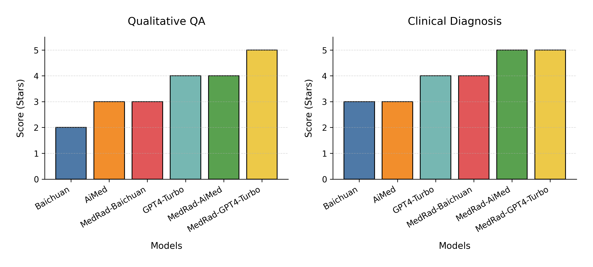

# Large Language Models Driven Reliable Clinical Decision-Making: Framework and Application

# 大语言模型驱动的可靠临床决策：框架与应用

## 摘要 Abstract

With the proliferation of data and increased complexity of clinical decision-making in the medical field, powerful computational tools are needed to assist physicians in making precision and reliable decisions. While the Large Language Models (LLMs) with billions of parameters in model size have obtained series of achievements in a broad range of biomedical and healthcare applications, the issues in terms of reliability and stability are still needed to be addressed. To this end, we propose the framework of MedRad, a system that combines LLMs, knowledge engineering, Chain of Thought (CoT) reasoning, Retrieval-Augmented Generation (RAG) techniques, and intelligent agents (Agents) to improve clinical decision-making reliability. Based on fine-tuned LLMs and existing studies in biomedical and healthcare domain, we further concentrate on how these techniques could be utilized to achieve highly reliable clinical decision-making in scenarios with varying complexity, such as medical knowledge QA and clinical diagnosis recommendations. Experimental results demonstrate that MedRad has the ability to provide high-quality decision paths in the above scenarios, and the potential to extend to more biomedical and healthcare scenarios through its loosely coupled design.

随着医疗领域数据的激增和临床决策复杂性的增加，需要强大的计算工具来协助医生做出精确和可靠的决策。虽然具有数十亿参数的大语言模型(LLMs)在广泛的生物医学和医疗保健应用中取得了一系列成就，但在可靠性和稳定性方面仍存在问题需要解决。为此，我们提出了MedRad框架，该系统结合了LLMs、知识工程、思维链(CoT)推理、检索增强生成(RAG)技术和智能代理(Agents)来提高临床决策的可靠性。基于微调的LLMs和生物医学与医疗保健领域的现有研究，我们进一步关注如何利用这些技术在不同复杂度的场景中实现高度可靠的临床决策，如医学知识问答和临床诊断建议。实验结果表明，MedRad能够在上述场景中提供高质量的决策路径，并通过其松耦合设计扩展到更多生物医学和医疗保健场景。

KEYWORDS
关键词

Large Language Models; Clinical Decision-Making; Chain of Thought; Retrieval-Augmented Generation; Intelligent Agents
大语言模型；临床决策；思维链；检索增强生成；智能代理

## 引言 Introduction

Reliable clinical decision-making is critical to improve the patient health. However, this kind of tasks always holds high complexity due to individual differences. The physicians usually bear huge pressure to handle a large amount of patient information and make critical decisions in a short period of time. Meanwhile, the complexity of clinical decision-making is continually increasing with the massive growth of medical data and the variability of clinical cases. Although the traditional clinical decision support systems (CDSS) are competent in dealing with standardized processes, they could hardly interpret unstructured medical data, handle complex cases, and extend to learn evolving medical knowledge. Accompanied by the public's concern for the quality of healthcare services increasing gradually, evidence-based medical decision-making^1^has become more and more prominent in research value, which means "combining the best currently available research evidence with one's own professional skills and patient values for treatment". In recent years, with the rapid development of artificial intelligence (AI), machine learning and big data analytics have been introduced into decision support tools to enhance their ability to manage complex data.

可靠的临床决策对改善患者健康至关重要。然而，由于个体差异，这类任务往往具有很高的复杂性。医生通常承受着巨大压力，需要在短时间内处理大量患者信息并做出关键决策。同时，随着医疗数据的大规模增长和临床病例的变异性，临床决策的复杂性也在不断增加。虽然传统的临床决策支持系统(CDSS)能够胜任标准化流程的处理，但它们难以解释非结构化医疗数据、处理复杂病例，也难以扩展学习不断发展的医学知识。随着公众对医疗服务质量关注度的逐渐提高，循证医学决策^1^的研究价值日益突出，它意味着"将当前最佳研究证据与个人专业技能和患者价值观相结合进行治疗"。近年来，随着人工智能(AI)的快速发展，机器学习和大数据分析已被引入决策支持工具，以增强其管理复杂数据的能力。

However, the applications of AI techniques have been severely challenged due to the complexity of clinical decision-making and the extremely high demands for reliability, such as the lack of theoretical and causal models, sensitivity to imperfect data, and higher arithmetic consumption(driven by the complexity of the problems and the accuracy requirements, leading to higher resource consumption)^2^. In late 2022, the release of ChatGPT brought an increasing interest in LLMs^3^, while its powerful capabilities in terms of content generation and human-computer interaction provides potential support to evidence-based clinical decision-making^4^.

然而，由于临床决策的复杂性和对可靠性的极高要求，AI技术的应用面临着严峻挑战，如缺乏理论和因果模型、对不完善数据的敏感性以及较高的计算消耗（由于问题的复杂性和对准确率的要求，导致计算成本）^2^。2022年底，ChatGPT的发布引发了对LLMs的日益关注^3^，而其强大的内容生成和人机交互能力为循证临床决策提供了潜在支持^4^。

In this study, a framework towards LLMs driven reliable clinical decision-making called MedRad(*MedRad: A Framework for **R **eliable **A **ssisted **D **ecision-Making in a **Med **ical Large Language Model*), is proposed to improve the accuracy of clinical decision-making, as well as enhance the reliability and stability of decision-making while maintaining the accuracy. By combining the latest artificial intelligence technologies including deep learning, natural language processing, and medical knowledge engineering, MedRad aims to create a more intelligent and adaptive clinical decision-making system, which would not only be able to process and analyze complex medical data, but also give clear, explainable and logical paths of decisions. Therefore, the physicians could better understand and trust the automatic generated decisions. In this way, the MedRad framework seeks to support healthcare professionals to make precision and reliable decisions in an increasingly complex healthcare environment.

在本研究中，我们提出了一个名为MedRad的框架（MedRad : A Framework for **R**eliable **A**ssisted **D**ecision Making in a **Med**ical LargeLanguage Model 一个医学大模型的可靠辅助决策框架），用于LLMs驱动的可靠临床决策，旨在提高临床决策的准确性，并在保持准确性的同时增强决策的可靠性和稳定性。通过结合深度学习、自然语言处理和医学知识工程等最新人工智能技术，MedRad旨在创建一个更智能和自适应的临床决策系统，该系统不仅能够处理和分析复杂的医疗数据，还能提供清晰、可解释和逻辑的决策路径。因此，医生可以更好地理解和信任自动生成的决策。通过这种方式，MedRad框架旨在支持医疗保健专业人员在日益复杂的医疗环境中做出精确和可靠的决策。


Figure 1.   Study framework.
图1. 研究框架。

## 相关工作 Related Works

#### 临床决策支持系统 Clinical Decision Support Systems

The history of Clinical Decision Support Systems dates back to 1970s. The first generation of CDSS was primarily based on rule-based reasoning to aid decision-making. Over time, data-based machine learning approaches have been gradually integrated into CDSS systems. With the development of powerful computing devices and widespread electronic health records (EHRs), CDSS began to utilize big data for more precision prediction and analysis, further evolving into Intelligent CDSS (ICDSS). Generally, ICDSS could be used to enable accurate diseases diagnosis and management^5^ cancers prevention and metastasis prediction^6^ organ failure prediction and mortality assessment^7^, etc., to help physicians generate clinical, therapeutic and diagnostic approaches for optimal disease management. Driven by artificial intelligence, considerable studies have begun to utilize deep learning techniques to empower ICDSS. For example, Rajkomar et al. demonstrated the potential application of deep learning models to handle EHRs and medical prediction tasks^8^. Moreover, Esteva et al. explored the accuracy of deep learning models in dermatological diagnosis, emphasizing the association between model interpretability and patient safety^9^. The U.S. AI healthcare startups Abridge, Birch.ai to produce solutions to automatically extract cases through doctor-patient dialog^10^.

临床决策支持系统的历史可以追溯到20世纪70年代。第一代CDSS主要基于规则推理来辅助决策。随着时间的推移，基于数据的机器学习方法逐渐集成到CDSS系统中。随着强大计算设备的发展和电子健康记录(EHRs)的广泛使用，CDSS开始利用大数据进行更精确的预测和分析，进一步发展为智能CDSS (ICDSS)。通常，ICDSS可用于实现准确的疾病诊断和管理^5^、癌症预防和转移预测^6^、器官衰竭预测和死亡率评估^7^等，以帮助医生生成临床、治疗和诊断方法，实现最佳疾病管理。在人工智能的推动下，大量研究开始利用深度学习技术来增强ICDSS。例如，Rajkomar等人展示了深度学习模型在处理EHRs和医疗预测任务方面的潜在应用^8^。此外，Esteva等人探索了深度学习模型在皮肤病诊断中的准确性，强调了模型可解释性与患者安全之间的关联^9^。美国AI医疗初创公司Abridge、Birch.ai开发了通过医患对话自动提取病例的解决方案^10^。

#### 大语言模型在医疗保健中的应用 Applications of Large Language Models in Healthcare

In recent years, large pre-trained language models, such as GPT and BERT, have begun to play a key role in medical domain with the development of computing power. These models are capable of processing a huge amounts of unstructured medical text data to provide deeper insights and predictions. Currently, they have been used to automate medical record summaries, medical literature analysis, disease prediction, and provide personalized health care recommendations. Google has led the way by releasing large models such as Med-PALM and Med-PALM2^11^ and presenting the medical assessment dataset MultiMedQA^12^. Although Med-PALM2 with 540B parameters has passed the U.S. Medical Licensing Examination (USMLE) exam with a promising score of 86.5, large language models still face challenges in dealing with highly specialized medical knowledge, especially in understanding complex medical terminology and clinical guidelines.

近年来，随着计算能力的发展，GPT和BERT等大型预训练语言模型开始在医疗领域发挥关键作用。这些模型能够处理大量非结构化医疗文本数据，提供更深入的见解和预测。目前，它们已被用于自动化医疗记录摘要、医学文献分析、疾病预测，并提供个性化医疗保健建议。谷歌通过发布Med-PALM和Med-PALM2^11^等大型模型以及推出医疗评估数据集MultiMedQA^12^走在前列。尽管具有540B参数的Med-PALM2以86.5分的优异成绩通过了美国医学执照考试(USMLE)，但大语言模型在处理高度专业化的医学知识方面仍面临挑战，特别是在理解复杂的医学术语和临床指南方面。

#### 思维链推理和检索增强生成技术 Chain of Thought Reasoning and Retrieval-Augmented Generation Technology

The Chain of Thought (CoT) reasoning technique enhances the logic and transparency of decision making by modeling the physician's thought process. By breaking down the decision-making process into a series of logical steps, CoT provides a more intuitive and interpretable way to explain the model's reasoning process^13^. The main idea is to utilize a large language model to interpret a small number of samples and explain the reasoning process in response to a prompt. Meanwhile, the Retrieval-Augmented Generation (RAG) technique strengthens the model's understanding of medical knowledge by combining powerful retrieval and generative capabilities^14^. This approach allows the model to retrieve relevant information from a large amount of medical data before making a decision, thus improving the accuracy and depth of decision making. Combining CoT and RAG could significantly upgrade the performance of CDSS, especially when dealing with complicated and non-standardized clinical cases.

思维链(CoT)推理技术通过模拟医生的思维过程来增强决策的逻辑性和透明度。通过将决策过程分解为一系列逻辑步骤，CoT提供了一种更直观和可解释的方式来解释模型的推理过程^13^。主要思想是利用大语言模型来解释少量样本，并根据提示解释推理过程。同时，检索增强生成(RAG)技术通过结合强大的检索和生成能力来加强模型对医学知识的理解^14^。这种方法允许模型在做出决策之前从大量医疗数据中检索相关信息，从而提高决策的准确性和深度。结合CoT和RAG可以显著提升CDSS的性能，特别是在处理复杂和非标准化的临床病例时。

### 采用机器进行临床决策面临的困扰 Challenges in Using Machines for Clinical Decision-Making

随着人工智能技术在医疗领域的广泛应用，如诊断、治疗建议等，算法偏见、算法决策的不稳定、算法决策的不可靠、数据隐私泄露、误诊责任模糊性等，均可能引发法律争议，法律界等其他领域也开始关注如何处理因AI系统导致的医疗相关问题^23^^24^。比如有工作采用定性分析方法，结合加纳的《解释法案》和普通法原则，分析AI医疗过失案件中的因果关系和责任分配问题^21^。某AI误诊诉讼中，法院判定算法开发者承担30%连带责任，强调开发者需确保模型透明性和可解释性。^22^系统性分析AI医疗的法律责任划分困境，提出“开发者-医疗机构-医生”三方共担责任模型，强调算法透明性对司法判定的重要性。

With the widespread application of artificial intelligence (AI) technologies in the medical field, such as in diagnosis and treatment recommendations, numerous challenges have emerged, including algorithmic bias, instability and unreliability of algorithmic decisions, data privacy breaches, and ambiguities in liability for misdiagnoses. These challenges have the potential to trigger legal disputes, prompting increasing attention from the legal community and other disciplines regarding how to address medical issues caused by AI systems ^23^ ^24^. For instance, some studies have employed qualitative analysis, integrating Ghana's *Interpretation Act *and common law principles to explore causality and liability distribution in cases of AI medical negligence ^21^. In one AI misdiagnosis lawsuit, a court ruled that the algorithm developer bore 30% joint liability, emphasizing the need for developers to ensure model transparency and interpretability ^22^. A systematic analysis of the challenges in allocating legal responsibility for AI in healthcare proposed a "developer–medical institution–physician" tripartite shared responsibility model, underscoring the critical importance of algorithm transparency in judicial determinations.

总的来说，尽管大语言模型在处理特定类型的医疗数据方面取得了显著进展，但在临床决策的稳定性和可靠性方面仍存在相当大的不足。这主要是因为这些模型在训练过程中缺乏对医学领域特定知识的深入理解，并可能受到训练数据导致的决策偏差的影响。此外，这些模型在透明度和可解释性方面通常存在争议，使得医疗保健专业人员难以理解和信任其决策过程和结果^15^。当前，将最新的LLM相关技术集成并应用于临床决策的工作仍然非常匮乏，还没有相关的开源工作对这一领域进行尝试性探索和报告，因此，本文提出了MedRad框架，该框架结合了大语言建模、知识工程、CoT和RAG技术，以提高医疗决策的效率和可靠性。

In summary, despite the significant progress made by large language models in processing specific types of medical data, there are still considerable deficiencies in terms of the stability and reliability of clinical decision-making. This is mainly due to the fact that these models lack in-depth understanding of medical domain-specific knowledge during the training process and may suffer from decision bias induced by the training data. In addition, these models are usually in dispute for sufficient transparency and interpretability, making it difficult for healthcare professionals to understand and trust their decision-making process and also results^15^.

To address these challenges, this paper introduces the MedRad framework, which integrates large language modeling, knowledge engineering, Chain-of-Thought (CoT) techniques, and Retrieval-Augmented Generation (RAG) methodologies. The goal of MedRad is to enhance the efficiency, reliability, and trustworthiness of medical decision-making. This framework serves as a pioneering attempt to systematically harness the latest LLM-related technologies for clinical decision-making, an area that currently lacks substantial open-source exploration or reporting.

## 方法 Methods

Generally, MedRad is a framework designed for more accurate and reliable medical decisions, which takes advantages of LLMs and logical reasoning principles to a broad dataset of medical knowledge. Specifically, MedRad could be defined as: given a predicate dataset  D , the goal is to design and implement a function f that enables it to transform the actual needs of a medical scenario R into reliable and accurate medical decisions  A . Formally, * f * :( D ,  R ) → A. In the following, the meaning of each symbol in the above equation will be introduced in detail.

通常，MedRad是一个为更准确和可靠的医疗决策而设计的框架，它利用LLMs和逻辑推理原理来处理广泛的医学知识数据集。具体而言，MedRad可以定义为：给定一个谓词数据集D，目标是设计和实现一个函数f，使其能够将医疗场景的实际需求R转换为可靠和准确的医疗决策A。形式上，f:(D, R) → A。在下文中，将详细介绍上述方程中每个符号的含义。

 D : a pre-data set that includes all available medical knowledge resources, both structured data (e.g. knowledge graphs, medical knowledge bases, etc.) and unstructured data (e.g. electronic medical records, online consultation records, etc.).

D：一个预数据集，包含所有可用的医学知识资源，包括结构化数据（如知识图谱、医学知识库等）和非结构化数据（如电子医疗记录、在线咨询记录等）。

 R : The actual demand of a medical scenario, which may be any medical query or demand, e.g., symptom query, therapeutic regime consultation, etc.

R：医疗场景的实际需求，可以是任何医疗查询或需求，例如症状查询、治疗方案咨询等。

 A : The medical decision or advice generated by the function, which is a direct response to the input demand  R . A should meet the criteria of interpretability and reliability to ensure that the replies provided in different medical contexts are evidence-based.

A：由函数生成的医疗决策或建议，是对输入需求R的直接响应。A应满足可解释性和可靠性的标准，以确保在不同医疗背景下提供的回复都是基于证据的。

 f : The decision function or model, which is the core transformation mechanism responsible for accepting the predicate dataset D and the actual requirements R as inputs, then generating the medical decisions A as outputs.

f：决策函数或模型，是核心转换机制，负责接受谓词数据集D和实际需求R作为输入，然后生成医疗决策A作为输出。

These symbols are used to abstractly represent the different components of the proposed medical decision support system. In this way, we could more precisely design and implement the system step-by-step to meet the stringent requirements for accuracy and reliability in the clinical domain. This will be explained in turn below.

这些符号用于抽象地表示所提出的医疗决策支持系统的不同组件。通过这种方式，我们可以更精确地逐步设计和实现系统，以满足临床领域对准确性和可靠性的严格要求。这将在下面依次解释。

### 医疗数据集 D Medical dataset D

A variety of medical data has been utilized to develop MedRad (Table 1). Among them, medical books and research publications were formatted into JSON files, while the rest were converted into text data for LLMs secondary pre-training. All of these data are in Chinese, which covers all aspects of modern medicine in China. However, traditional Chinese medicine data was not addressed here.

已利用各种医疗数据来开发MedRad（表1）。其中，医学书籍和研究出版物被格式化为JSON文件，而其余数据被转换为文本数据用于LLMs的二次预训练。所有这些数据都是中文的，涵盖了中国现代医学的各个方面。然而，这里没有涉及中医数据。

Table 1.   Chinese medical dataset for MedRad training. (Detailed examples can be found in Appendix 2.)
表1. MedRad训练用的中文医疗数据集。（详细实例参见附录2）

| 编号 | 医疗数据       | 记录数    | 格式 |
| ---- | -------------- | --------- | ---- |
| 1    | 电子健康记录   | 75,240    | JSON |
| 2    | 医学书籍       | 188       | TXT  |
| 3    | 临床实践指南   | 10,030    | JSON |
| 4    | 医学期刊出版物 | 200,000   | TXT  |
| 5    | 疾病库         | 7,409     | JSON |
| 6    | 症状库         | 5,333     | JSON |
| 7    | 检查库         | 522       | JSON |
| 8    | 药物库         | 8,521     | JSON |
| 9    | 医疗问答       | 1,000,000 | JSON |

These data were primarily constructed through a systematic knowledge engineering process within the medical domain. During the knowledge acquisition phase, 20 medical informatics experts performed structured organization of data sourced from medical libraries and biomedical databases. In the knowledge management phase, classification schemes such as ICD were employed to conduct fine-grained categorization of all data based on data type, format, and medical disciplinary domain. In the knowledge curation phase, data characteristics were analyzed by type, and targeted annotation guidelines were developed accordingly. The annotation process was led by one domain expert and supported by five medical students, with data annotated sequentially by type. For example, due to the long-text nature of medical textbooks, both coarse- and fine-grained redundancy filtering strategies were applied. In contrast, for structured medical publications, data alignment was required between XML and JSON formats.

这些数据主要通过在医学垂直领域进行系统化知识工程来完成。在知识获取阶段，由20位医学信息学专家对医疗图书馆和医学数据库中的数据进行结构化整理。在知识管理阶段，通过使用ICD等分类方法对所有数据按照数据类型、数据格式、数据所属医学学科范畴进行细粒度分类。在知识整理阶段，考虑到不同数据的特征差异，进行逐类型数据的特征分析，然后形成针对性标注规范，并由1位专家牵头5位医学生配合，逐类型数据依次完成标注。比如针对医学书籍的长文本特性，需要采用粗粒度和细粒度的数据重复性过滤；而针对医学出版物的结构化特性，需要从xml格式对齐到json格式等。

Building on the aforementioned dataset, we utilized the Baichuan model to train a new model called  AiMed . The detailed training procedures and configurations can be found in Appendix 1. Comparative experimental results are presented directly in the subsequent sections of this paper.

此外，在这些数据的基础上，我们利用baichuan模型训练出了AiMed模型，相关训练细节可以参考附录1，相关对比实验在后文将直接提供。

### 医疗场景需求 R Medical Scenario Requirements R

A whole-process, whole-scene healthcare refers to health management and disease prevention, diagnosis, control, treatment, as well as rehabilitation. Through exhaustive analysis of the mainstream, more than 40 medical scenarios will be involved, for example, intelligent consultation, intelligent imaging, intelligent records, surgical robots, surgical navigation, intelligent operating rooms, AI pharmaceuticals and remote intelligent clinical trials. The AI+ healthcare aims to enhance the efficiency and quality of healthcare services through advanced technologies, and provides patients with precision healthcare management. Especially, two typical medical scenarios were selected for further research and discussion, namely medical knowledge quiz and clinical diagnosis recommendations, which represent the common and the high complexity of clinical decision-making systems respectively.

全流程、全场景医疗保健是指健康管理和疾病预防、诊断、控制、治疗以及康复。通过对主流的全面分析，将涉及40多个医疗场景，例如智能问诊、智能影像、智能记录、手术机器人、手术导航、智能手术室、AI制药和远程智能临床试验。AI+医疗保健旨在通过先进技术提高医疗保健服务的效率和质量，为患者提供精准的医疗保健管理。特别是，选择了两个典型的医疗场景进行进一步研究和讨论，即医学知识问答和临床诊断建议，它们分别代表了临床决策系统的常见性和高复杂性。

#### 医学知识问答 Medical Knowledge QA

The medical knowledge QA is referred to the task of using AI systems to automatically answer medical questions posed by users in order to meet their knowledge needs. Unlike existing search engines, QA system is an advanced product of information service that return users with precise natural language answers, rather than a list of documents sorted based on keyword matching. To quantitatively evaluate the performance of medical knowledge QA system, a diversity of datasets has been elaborately presented in English, such as MedQA^16^、MedMCQA^17^、MultiMedQA^12^、PubMedQA^18^.

医学知识问答是指使用AI系统自动回答用户提出的医学问题以满足其知识需求的任务。与现有的搜索引擎不同，问答系统是一种高级的信息服务产品，它为用户提供精确的自然语言答案，而不是基于关键词匹配排序的文档列表。为了定量评估医学知识问答系统的性能，已经精心提出了多种英文数据集，如MedQA^16^、MedMCQA^17^、MultiMedQA^12^、PubMedQA^18^。

#### 临床诊断建议 Clinical Diagnosis Recommendations

The clinical diagnosis recommendations scenario typically refers to automatically make decisions about the  subsequent examination and treatment plan based on the doctor-patient dialogues. For example, the patient says, " Doctor, yesterday I had a sudden weakness and numbness on my right side. It lasted for a few minutes and then went away. I also had difficult speaking for a while. Can you help me figure out what happened? " A promising decision-making system is supposed to simulate a doctor and answer the question based on the patient's description, such as:

"You may have experienced a transient ischemic attack. You'd better take some examinations to confirm the diagnosis. We need to start with radiology imaging procedures, hematology tests (blood tests), complete blood count (CBC), x-ray computed tomography (scan CT), electrocardiogram, renal function tests (kidney function tests), and glucose measurements (glucose levels) to get a better understanding of what happened. Can we schedule these examinations for you?"

"您可能经历了短暂性脑缺血发作。最好做一些检查来确认诊断。我们需要从放射影像学检查、血液学检查（血液检查）、全血细胞计数（CBC）、X射线计算机断层扫描（CT扫描）、心电图、肾功能检查（肾功能检测）和血糖测量（血糖水平）开始，以更好地了解发生了什么。我们可以为您安排这些检查吗？"

### 决策方法论 F Decision-making methodology F

The MedRad framework specially concentrates on a loosely coupled design with the baseline LLMs, and focuses on how to utilize advanced technologies to achieve more reliable medical decisions in different medical scenarios. Table 2 list the main technologies involved in MedRad.

MedRad框架特别注重与基线LLMs的松耦合设计，并关注如何利用先进技术在不同医疗场景中实现更可靠的医疗决策。表2列出了MedRad涉及的主要技术。

Table 2.  The main technologies involved in MedRad.
表2. MedRad涉及的主要技术。

| No. | Technology                                            | Description                                                                                                                                                                            |
| --- | ----------------------------------------------------- | -------------------------------------------------------------------------------------------------------------------------------------------------------------------------------------- |
| 1   | Domain-Specific LLMs Training(Secondary Pre-training) | Train LLMs from scratch for specific medical domains and focus on in-depth learning of medical knowledge. Currently, medical corpus and high computational resource are very critical. |
| 2   | Domain-Adaptive Fine-tuning                           | Further fine-tuning on medical domain data based on general LLMs aims to integrate general information with specialized medical knowledge.                                             |
| 3   | Mixture of Experts (MoE)                              | Integrating multiple expert models through the MoE architecture utilizes the specialized knowledge of different models to improve decision accuracy and reliability19.                 |
| 4   | Retrieval-Augmentation(RAG)                           | A retrieval mechanism allows the model to access external information sources, in order to enhance the ability and quality of decision-making on specific questions.                   |
| 5   | Chain of Thought (CoT)                                | Emphasize that LLMs should provide detailed reasoning steps when making decision, to improve the interpretability and credibility of decisions.                                        |
| 6   | Agents                                                | A system which takes LLMs as its core controllers; Meanwhile, the LLMs could be capable of perceiving its environment and taking actions in a period to achieve its goals.             |

| 编号 | 技术                           | 描述                                                                                               |
| ---- | ------------------------------ | -------------------------------------------------------------------------------------------------- |
| 1    | 领域特定LLMs训练（二次预训练） | 从头开始针对特定医疗领域训练LLMs，专注于医学知识的深入学习。目前，医学语料库和高计算资源非常关键。 |
| 2    | 领域自适应微调                 | 基于通用LLMs对医疗领域数据进行进一步微调，旨在将通用信息与专业医学知识相结合。                     |
| 3    | 专家混合(MoE)                  | 通过MoE架构整合多个专家模型，利用不同模型的专业知识来提高决策的准确性和可靠性19。                  |
| 4    | 检索增强(RAG)                  | 检索机制允许模型访问外部信息源，以增强对特定问题的决策能力和质量。                                 |
| 5    | 思维链(CoT)                    | 强调LLMs在做出决策时应提供详细的推理步骤，以提高决策的可解释性和可信度。                           |
| 6    | 智能代理                       | 一个以LLMs为核心控制器的系统；同时，LLMs能够感知其环境并在一段时间内采取行动以实现其目标。         |

Specifically, the implementation of components 1–3 aligns with AiMed, a large language model developed for the medical domain, please refer to Appendix 1 for more details. Components 4–5 are more engineering-oriented practices, involving limited technical complexity. This section provides an extended discussion on the Agent design. Currently, the architecture of Agent systems has reached a relatively mature stage. General-purpose development frameworks include  *LangChain* , which focuses on language model application development, supporting scenarios such as conversational agents and document analysis. It is compatible with multiple large models and introduces an Agent protocol for cross-framework collaboration. Microsoft’s *AutoGen* supports automated generation of code, models, and workflows, with a layered architecture designed to accommodate diverse application scenarios. Its stable version V0.4, released in 2025, enhances production-level deployment capabilities. Other frameworks such as *Crew AI* and *Semantic Kernel* are also notable in this space.

For domain-specific frameworks, *RASA* specializes in conversational AI, offering core functionalities such as intent recognition and context management, and is widely used for chatbot development. Other emerging frameworks include *ModelScope-Agent* and  *Evolving Agents* .

The proposed *MedRad* is a lightweight, self-developed Agent framework that is not built upon any of the aforementioned open-source Agent frameworks. Instead, it is tailored toward the execution process design in clinical decision-making scenarios. Further details will be provided in the following sections.

其中，针对1-3的具体实现与医学领域的大语言模型AiMed保持一致，详细情况参见附录1，4-5更多是一种工程方法的实践，不存在较多的技术细节，这里对Agent进行扩展说明。当前，Agent相关架构已经较为成熟。包括综合型开发框架：LangChain专注于语言模型应用开发，支持对话助手、文档分析等场景，兼容多种大模型，并推出Agent协议实现跨框架协作；微软的AutoGen支持自动化生成代码、模型和工作流，分层架构设计适配不同场景，2025年发布V0.4稳定版强化生产部署能力，除此之外还有Crew AI、Semantic Kernel等；垂直领域框架：**RASA**专注对话式AI，提供意图识别、上下文管理等核心功能，适用于聊天机器人开发；以及ModelScope-Agent、Evolvong Agents等。本文提出的MedRad是自研的轻量级Agent框架，没有在上述开源的Agent框架上进行二次开发，而是更聚焦医疗决策场景下的执行过程设计，在下文中会有进一步的说明。

### 决策结果 A Decision outcome A

The decision outcome of the proposed MedRad mainly depends on the effective combination of RAG, CoT and Agent technologies. Specifically, MedRad firstly utilizes RAG to look for the information and knowledge related to the scenario from a large amount of medical data, then analyzes the problem by constructing a CoT, and finally combines the Agent's ability to synthesize and evaluate the results of the RAG and CoT for a final decision  A .

所提出的MedRad的决策结果主要取决于RAG、CoT和Agent技术的有效组合。具体而言，MedRad首先利用RAG从大量医疗数据中寻找与场景相关的信息和知识，然后通过构建CoT分析问题，最后结合Agent的能力来综合和评估RAG和CoT的结果，得出最终决策A。

To facilitate subsequent experiments, we selected two scenarios for detailed discussion in this paper: quantitative analysis of medical knowledge Q&A and qualitative analysis of clinical diagnostic recommendations. Other scenarios can be similarly adapted and implemented.

为了后续试验方便，我们选择了可以定量分析的医学知识问答和定性分析的临床诊断建议两个场景在本文中进行展开。其他场景可以类似迁移实现。

#### 医学知识问答的结果 Outcome of Medical Knowledge QA

The medical knowledge Q&A scenario typically includes a multiple-choice question, such as the example shown in the table below. The goal is to identify the option that does not belong to the surgical choices for treating morbid obesity. This type of question generally requires a deep understanding of a specific medical domain.

医学知识问答场景，通常包含一个多项选择题，比如下表所示的这个例子，目的是识别出不属于治疗病态肥胖手术选择的选项。这种类型的问题通常要求对特定医学领域有深入了解。

```
{
    "QU": "The following are surgical options for treating morbid obesity, except:",
    "OP": {
        "A": "Adjustable gastric banding",
        "B": "Biliopancreatic diversion",
        "C": "Duodenal switch",
        "D": "Roux-en-Y duodenal bypass"
    },
    "EXP": "The correct answer is 'D,' i.e., Roux-en-Y duodenal bypass. The Roux-en-Y gastric bypass surgery procedure includes: (a) Vertical banded gastroplasty, (b) Adjustable gastric banding, (c) Roux-en-Y gastric bypass (not the Roux-en-Y duodenal bypass procedure), and (d) Biliopancreatic diversion, Duodenal switch. Surgical treatment for morbid obesity is referred to as bariatric surgery. Morbid obesity is defined as a body mass index (BMI) of 35 kg/m2 or higher with obesity-associated comorbidities, or a BMI of 40 kg/m2 or higher without comorbidities. Weight loss following bariatric surgery is achieved through two mechanisms: dietary restriction and malabsorption of ingested food. (1) Restrictive surgeries include vertical banded gastroplasty and adjustable gastric banding, (2) Malabsorptive surgeries include biliopancreatic diversion and duodenal switch. Roux-en-Y gastric bypass has both restrictive and malabsorptive components. The mechanisms of action for bariatric surgeries are as follows: Restrictive: Vertical banded gastroplasty, Laparoscopic adjustable gastric banding. Predominantly restrictive/mildly malabsorptive: Roux-en-Y gastric bypass. Predominantly malabsorptive/mildly restrictive: Biliopancreatic diversion.",
    "AN": "D"
}
```

```json
{
        "QU": "以下都是治疗病态肥胖的手术选择，除了-",
        "OP":
        {
            "A": "可调节胃束带",
            "B": "胆胰分流",
            "C": "十二指肠开关",
            "D": "Roux en y十二指肠旁路"
        },
        "EXP": "Ans.是“d”，即Roux en Y十二指肠旁路减肥手术程序包括：a。垂直带状腹足虫。可调节胃束带。Roux-en-Y胃旁路术（非Roux-en-Y-十二指肠旁路术）d。胆胰分流。十二指肠切除术病态肥胖的外科治疗被称为减肥手术。病态肥胖被定义为体重指数为35 kg/m2或以上，伴有肥胖相关的合并症，或BMI为40 kg/m2或更大，没有合并症。减肥手术导致体重减轻是由两个因素造成的。一是限制饮食。另一种是摄入食物的吸收不良。o胃限制性手术包括垂直带状胃成形术和可调节胃束带术o吸收不良手术包括胆胰分流，十二指肠切换器Roux-en-Y胃旁路既有限制性又有吸收不良的特点减肥手术：作用机制限制性垂直胃束带腹腔镜可调节胃束带大范围限制性/轻度吸收不良Roux-en-Y胃旁路大范围吸收不良/轻度限制性胆胰分流",
        "AN": "D"
},
```

To handle scenarios of this kind, **MedRad** leverages extensive pre-trained medical knowledge to accurately comprehend the questions and quickly deliver the correct answers. The Q&A tasks are implemented using **RAG**, **CoT**, and **Agent**, as illustrated in Figure 2.

The process consists of three key steps:

1. **Information Retrieval (RAG)**: This step employs retrieval-augmented generation (RAG) techniques to identify information relevant to the question from a large corpus of medical data. The primary objective is to swiftly pinpoint medical knowledge and data pertinent to the query.
2. **Chain of Thought (CoT)**: In this step, a chain-of-thought (CoT) reasoning framework is used to analyze the question. This involves understanding the specific requirements of the question, parsing the options, and comparing them against the retrieved information. This step facilitates an in-depth comprehension of the question's context and the implications of each option.
3. **Intelligent Agent (Agent)**: Finally, an intelligent agent integrates the results from the previous two steps for comprehensive analysis and derives the final answer. The agent performs decision-making and validation functions, ensuring the answer's accuracy and logical consistency.

By combining these three methodologies, **MedRad** achieves a structured, systematic, and precise approach to medical Q&A tasks.

要处理这类场景，MedRad预先学习大量医学知识并准确理解问题，然后快速返回正确答案。将采用RAG、CoT和Agent来实现问答任务，见图2。第一步是**信息检索（RAG）** : 使用信息检索技术从大量数据中找到与问题相关的信息。这一步骤的目的是快速定位与问题相关的医学知识和数据。第二步是**思维链（CoT）** : 通过构建思维链来分析问题。这包括理解问题的具体要求，解析各个选项，并将其与检索到的信息相对比。这一步骤有助于深入理解问题的背景和每个选项的含义。最后是**智能代理（Agent）** : 结合Agent的能力，对上述两步骤的结果进行综合分析，并得出最终答案。Agent在这里起到的是决策和验证的作用，确保答案的准确性和逻辑性。


Figure 2.  The framework of medical knowledge QA
图2. 医学知识问答的框架

For example, in the case of the example above, **MedRad **first needs to identify that the question is about surgical treatments for morbid obesity. Then, through  **RAG ** , it retrieves relevant medical information, such as the types and characteristics of various surgical procedures. Using  **CoT ** , it analyzes each option, understands the surgical principles behind them, and identifies which option does not belong to the set of procedures used to treat morbid obesity. Finally, the **Agent **integrates and verifies this information to determine the correct answer.

Typically, **MedRad **requires a five-step process to complete the Q&A task. Pseudocode for this process is provided in  **Appendix 3 ** .

比如针对上面的例子，MedRad首先需要识别问题是关于病态肥胖的治疗手术，然后通过RAG检索相关的医学信息，比如各种手术的类型和特点。通过CoT分析每个选项，理解它们各自的手术原理，并确定哪个选项不属于治疗病态肥胖的手术。最后，Agent将结合这些信息来验证并确定正确的答案。

通常，MedRad需要5个步骤来实现问答任务。在附录3中提供了伪代码。

① Starts the QA session once the Agent receives a medical question from users;
① 当Agent收到用户的医学问题时，启动问答会话；

② The Agent recognizes the question through keyword extraction, categorization of question type (e.g., symptom query, drug information, or disease-related knowledge), and urgency assessment;
② Agent通过关键词提取、问题类型分类（如症状查询、药物信息或疾病相关知识）和紧急程度评估来识别问题；

③ Adopt RAG technique to find the most relevant information about the question from medical dataset. For each possible option (e.g., A, B, C, D), the Agent analyzes and compares them separately, as well as assesses the accuracy, relevance and reliability. The medical knowledge required here covers medical terminologies, pathological mechanisms, treatment protocols, and also drug effects;
③ 采用RAG技术从医疗数据集中找到与问题最相关的信息。对于每个可能的选项（如A、B、C、D），Agent分别进行分析和比较，并评估其准确性、相关性和可靠性。这里需要的医学知识涵盖医学术语、病理机制、治疗方案以及药物作用；

④ The Agent performs a comprehensive analysis to compare the supporting evidence of different options, by considering the consistency of the medical logic and clinical practice; At the same time, it checks the credibility, timeliness, and consistency of the information sources with the existing medical consensus;
④ Agent通过考虑医学逻辑和临床实践的一致性，对不同选项的支持证据进行全面分析；同时，检查信息源与现有医学共识的可信度、时效性和一致性；

⑤ The Agent figures out the best answer based on a comprehensive evaluation of the options and the consistency check with the medical evidence; It then provides feedback to the user, including the basis for the answer, relevant medical information, and possible further recommendations or instructions.
⑤ Agent根据对选项的综合评估和与医学证据的一致性检查，找出最佳答案；然后向用户提供反馈，包括答案的依据、相关医学信息以及可能的进一步建议或指导。

The whole process encompasses the entire workflow from receiving a user question to providing a well-considered, information-supported answer. For practical application, the Agent will also include additional functionalities such as the ability to interact with the user, the ability to handle vague or incomplete queries, and the ability to continuously learn and adapt to new information.

整个过程涵盖了从接收用户问题到提供经过深思熟虑、有信息支持的答案的完整工作流程。对于实际应用，Agent还将包括额外的功能，如与用户交互的能力、处理模糊或不完整查询的能力，以及持续学习和适应新信息的能力。

#### 临床诊断建议的结果 Outcome of Clinical Diagnosis Recommendations

The clinical case diagnosis scenario is one of the most challenging tasks in the medical domain, as it requires not only a comprehensive analysis of medical record data but also the integration of this information with a complex body of medical knowledge. The following table illustrates a basic example. (Considering that de-identified clinical medical records may still fail to meet criteria for direct public disclosure, the example provided here is generated by a large-scale model based on real clinical cases for the purpose of explanation and demonstration):

临床病历诊断场景是医学领域中最具挑战性的场景之一，因为它不仅涉及到对病历数据的全面分析，还需要将这些信息与复杂的医学知识体系相结合。如下表是一个基本的例子（考虑到临床病历脱敏后仍可能不满足直接公开条件，这里采用大模型参照真实病历生成一个例子进行解释说明）：

表 临床病历诊断场景实例

**Table: Example of a Clinical Case Diagnosis Scenario**

| 项目       | 具体内容                                                                                                                                 |
| ---------- | ---------------------------------------------------------------------------------------------------------------------------------------- |
| 姓名       | 患者                                                                                                                                     |
| 病室       | 神经外科二病区                                                                                                                           |
| 床号       | 33                                                                                                                                       |
| 住院天数   | 18天                                                                                                                                     |
| 入院诊断   | 1. 颅内血肿  2. 轻度脑震荡                                                                                                               |
| 入院时情况 | 患者，男，38岁，因“头部外伤后出现头痛、恶心、呕吐”入院。体查：意识清楚，言语流畅，头部CT显示额叶小区域出血，无肢体瘫痪，生命体征稳定。 |
| 入院经过   | 患者入院后立即进行神经外科会诊，决定保守治疗。予以降颅压、止痛、抗恶心治疗。复查头部CT显示血肿无明显扩大，神经功能恢复良好。             |
| 出院时情况 | 患者目前头痛症状明显缓解，无恶心呕吐，头部CT复查显示血肿吸收良好，无新的出血点。一般情况好，生命体征稳定。                               |
| 出院诊断   | 1. 颅内血肿  2. 轻度脑震荡                                                                                                               |
| 出院医嘱   | 1. 继续服用降颅压药物一周。                                                                                                              |
|            | 2. 避免剧烈运动，注意休息，避免头部再次受伤。                                                                                            |
|            | 3. 一个月内到神经外科复查，必要时进行头部CT检查。                                                                                        |
|            | 4. 若出现头晕、呕吐等症状，应立即返回医院就诊。                                                                                          |
|            | 5. 保持良好的心态，适当进行认知及情绪调整。                                                                                              |

| **Item**                      | **Details**                                                                                                                                                                                                                                                                                                                                          |
| ----------------------------------- | ---------------------------------------------------------------------------------------------------------------------------------------------------------------------------------------------------------------------------------------------------------------------------------------------------------------------------------------------------------- |
| **Name**                      | Patient                                                                                                                                                                                                                                                                                                                                                    |
| **Ward**                      | Neurosurgery, Ward 2                                                                                                                                                                                                                                                                                                                                       |
| **Bed Number**                | 33                                                                                                                                                                                                                                                                                                                                                         |
| **Hospitalization Duration**  | 18 days                                                                                                                                                                                                                                                                                                                                                    |
| **Admission Diagnosis**       | 1. Intracranial Hematoma  2. Mild Concussion                                                                                                                                                                                                                                                                                                               |
| **Condition on Admission**    | The patient, a 38-year-old male, was admitted due to "head trauma followed by headache, nausea, and vomiting." Physical examination revealed the following: clear consciousness, fluent speech, no limb paralysis, and stable vital signs. Head CT indicated a small hemorrhagic area in the frontal lobe.                                                 |
| **Course of Hospitalization** | After admission, the patient immediately underwent a neurosurgical consultation, and conservative treatment was selected. Treatment included intracranial pressure reduction, pain relief, and anti-nausea management. Follow-up head CT scans indicated that the hematoma did not expand significantly, and neurological function improved substantially. |
| **Condition on Discharge**    | At discharge, the patient's headache symptoms had significantly improved. Nausea and vomiting were resolved. Follow-up head CT showed satisfactory absorption of the hematoma with no new hemorrhagic foci detected. General condition was good, and vital signs were stable.                                                                              |
| **Discharge Diagnosis**       | 1. Intracranial Hematoma  2. Mild Concussion                                                                                                                                                                                                                                                                                                               |
| **Discharge Instructions**    | 1. Continue taking intracranial pressure-lowering medication for one week.                                                                                                                                                                                                                                                                                 |
|                                     | 2. Avoid strenuous physical activities, take adequate rest, and prevent further head injuries.                                                                                                                                                                                                                                                             |
|                                     | 3. Visit the neurosurgery department for a follow-up within one month and undergo head CT scans if necessary.                                                                                                                                                                                                                                              |
|                                     | 4. Return to the hospital if symptoms such as dizziness or vomiting occur.                                                                                                                                                                                                                                                                                 |
|                                     | 5. Maintain a positive mindset and make appropriate cognitive and emotional adjustments.                                                                                                                                                                                                                                                                   |

对于临床诊断建议场景，MedRad根据患者的主诉自动诊断疾病，并提出后续治疗措施。处理此类场景的方法可以采用结合CoT、RAG和Agent的策略。第一步是**病历数据分析（CoT）** : MedRad彻底分析病历中的所有信息，包括患者的基本信息、入院和出院的诊断、治疗过程、出院时的情况以及出院医嘱。这一步骤要求MedRad能够准确理解并整合病历中的复杂信息。之后是**医学知识检索（RAG）** : 根据病历中的关键信息，如诊断、治疗方法和患者反应，检索相关的医学文献、指南或数据库，以获得更深入的医学见解和背景信息。这包括对特定疾病、治疗方法及其可能的副作用等的了解。最后是**综合分析和诊断（Agent）** : MedRad结合病历数据和医学知识，进行综合分析，以评估治疗效果、识别可能的并发症或需要进一步关注的问题。在这个过程中，Agent需要具备高级的临床判断能力，以便提供准确的诊断和建议。

For clinical diagnostic recommendation scenarios, MedRad autonomously diagnoses diseases based on the patient’s chief complaints and suggests subsequent treatment options. The approach to handling such scenarios can involve a strategy that combines **Chain-of-Thought (CoT), Retrieval-Augmented Generation (RAG),** and **Agent-based Reasoning.** The steps are outlined as follows:

**Step 1: Clinical Case Analysis (CoT)**

MedRad performs an in-depth analysis of all information contained in the medical record, including the patient’s basic information, admission and discharge diagnoses, treatment processes, discharge conditions, and discharge instructions. This step requires MedRad to accurately understand and integrate the complex information present in the medical case to establish a foundation for diagnosis and treatment recommendations.

**Step 2: Medical Knowledge Retrieval (RAG)**

Based on the key information extracted from the medical record, such as diagnoses, treatment methods, and patient responses, MedRad retrieves relevant medical literature, clinical guidelines, or database resources to obtain deeper medical insights and contextual information. This may involve gathering knowledge on specific diseases, exploring evidence-based treatment options, and investigating potential side effects or complications.

**Step 3: Comprehensive Analysis and Diagnosis (Agent)**

MedRad integrates the analyzed medical record data with the retrieved medical knowledge to conduct a comprehensive assessment. This process evaluates treatment outcomes, identifies potential complications, and pinpoints areas requiring further attention. The Agent component is responsible for advanced clinical reasoning and decision-making, ensuring that accurate diagnostic conclusions and actionable treatment recommendations are provided.

By systematically combining CoT for contextual understanding, RAG for medical knowledge enrichment, and Agent for expert-level clinical reasoning, MedRad enables a robust and reliable workflow to support clinical diagnostic and treatment decisions.

例如，在上述提供的病历中，需要进行RAG，如:

* 针对颅内血肿和轻度脑震荡，需要检索相关的治疗方案、药物使用指南和患者护理建议。
* 检索颅内血肿的常见并发症和警示症状，以便及时识别和处理。
* 考虑到患者年龄和性别，还可以检索相关人群中颅内血肿的常见原因和预后情况。

之后Agent需要在相关信息上：

* 根据病历数据和检索到的医学信息，可以分析患者治疗的有效性和预后。
* 评估患者恢复过程中可能面临的风险，如颅内压增高或再次出血。
* 提供针对性的建议，如定期复查、生活方式调整和可能的康复治疗。

图3列出了这里涉及的主要步骤，附录4给出了相应伪代码。

For instance, based on the medical records provided above, it is necessary to perform RAG (Retrieval-Augmented Generation) as follows:

* Retrieve relevant treatment protocols, medication guidelines, and patient care recommendations for conditions such as intracranial hematoma and mild concussion.
* Search for common complications and warning symptoms associated with intracranial hematoma to facilitate timely identification and intervention.
* Considering the patient's age and gender, retrieve information on typical causes and prognostic outcomes of intracranial hematoma within similar demographic groups.

Subsequently, the Agent is required to process the retrieved information by:

* Analyzing the effectiveness of treatment and prognosis based on the data from the medical records and retrieved medical knowledge.
* Assessing potential risks during the patient's recovery process, such as increased intracranial pressure or recurrent bleeding.
* Providing targeted recommendations, such as regular follow-ups, lifestyle adjustments, and potential rehabilitation therapies.

Figure 3 outlines the main steps involved in the process, while Appendix 4 provides the corresponding pseudocode.

① The Agent analyzes and understands the patient's complaint, then interprets the key symptom information;
① Agent分析和理解患者的主诉，然后解释关键症状信息；

② Based on the Clinical Thinking Path, specific symptoms are extracted from the patient's chief complaint and relevant information will be collected by searching the dataset D through RAG;
② 基于临床思维路径，从患者的主诉中提取具体症状，并通过RAG搜索数据集D收集相关信息；

③ The Agent combines the retrieved data to make a preliminary decision, which always considers the possibilities of different diseases;
③ Agent结合检索到的数据做出初步决策，始终考虑不同疾病的可能性；

④The Agent suggests appropriate clinical examinations  to confirm the diagnosis;
④ Agent建议适当的临床检查以确认诊断；

⑤ After checking the examination results, the Agent makes treatment recommendations, including medication, surgery, or other medical interventions; Moreover, with the help of RAG, it searches the medical literature and clinical guidelines to ensure that the recommendations are consistent with the latest medical research and best practices;
⑤ 在检查结果后，Agent提出治疗建议，包括用药、手术或其他医疗干预；此外，在RAG的帮助下，它搜索医学文献和临床指南，以确保建议与最新的医学研究和最佳实践一致；

⑥ Ultimately, the Agent integrates all the information to provide a comprehensive decision summary, which aimes to assist the physician in determining the best treatment path and also provide clear explaination to the patient.
⑥ 最终，Agent整合所有信息提供全面的决策总结，旨在协助医生确定最佳治疗路径，并为患者提供清晰的解释。

In the clinical diagnosis recommendations scenario, the Agent simulates the way what a doctor thinks as far as possible at every step to ensure that the resulting decisions meet both clinical standards and the needs of individual patient. This process requires not only advanced natural language processing capabilities, but also an in-depth medical knowledge understanding and strong logical reasoning.

在临床诊断建议场景中，Agent尽可能在每一步模拟医生的思维方式，以确保产生的决策既符合临床标准，又满足个体患者的需求。这个过程不仅需要先进的自然语言处理能力，还需要深入的医学知识理解和强大的逻辑推理能力。


Figure 3.  The framework of clinical diagnosis recommendations.
图3. 临床诊断建议的框架。

## 实验与结果 Experiment & Results

This section presents MedRad's performance across two primary clinical application scenarios, accompanied by a comparative analysis of experimental results against current leading large language models (LLMs). Specifically, the quantitative metric of *precision *will be utilized to evaluate MedRad's capability in medical knowledge question answering, with the testing dataset sourced from the Chinese National Medical Licensing Examination^20^, consisting of 1,000 questions. Furthermore, an open evaluation platform has been established, engaging 20 senior chief physicians from top tertiary hospitals in China to conduct qualitative assessments of MedRad. For this purpose, a test set comprising 200 samples was created by randomly extracting 10 electronic medical record diagnoses from various departments within these tertiary hospitals. These evaluations aim to assess the effectiveness and accuracy of MedRad in real-world clinical decision-making.

本节将展示MedRad在两个主要临床应用场景中的表现，并基于当前领先的LLMs对实验结果进行比较分析。特别是，将采用定量指标精确度来评估医学知识问答的能力，测试数据来自中国国家医师资格考试^20^，共计1000道题。此外，还构建了一个开放测试平台，由来自中国顶级三甲医院的20位高级主任医师负责对MedRad进行定性评估，评估所用的测试集合为从该三甲医院的各个科室随机采样10个电子病历诊断书，共计200个数据。这些测试旨在评估MedRad在真实世界临床决策中的有效性和准确性。

Given the linguistic diversity of clinical medical data and literature resources, this study particularly emphasizes the importance of supporting multilingualism in the development of MedRad, mainly focusing on the integration of Chinese and English resources. Therefore, the well-known general LLMs, namely GPT-4-Turbo and Baichuan were chosen for the following comparison, both of which are advanced models for natural language processing tasks in English and Chinese separately. In addition, we have specially developed and compared a large model, AiMed, which has been specifically secondary pre-trained for the medical domain based on the Baichuan model, with the aim of exploring the performance of professionally customized models in medical applications.

鉴于临床医疗数据和文献资源的语言多样性，本研究特别强调在MedRad开发中支持多语言的重要性，主要关注中英文资源的整合。因此，选择了知名的通用LLMs，即GPT-4-Turbo和Baichuan进行以下比较，它们分别是英文和中文自然语言处理任务的先进模型。此外，我们还专门开发和比较了一个大型模型AiMed，该模型基于Baichuan模型针对医疗领域进行了特定的二次预训练，旨在探索专业定制模型在医疗应用中的表现。

To comprehensively evaluate the performance of MedRad and the comparative methods, the experimental results will be qualitatively summarized using a five-level grading system: very poor, barely passable, average, good, and excellent, represented by 1 to 5 stars. This grading system not only allows for intuitive visualization of the relative performance of each method but also facilitates the comparison of effectiveness across different clinical decision-making scenarios. In addition to assessing medical knowledge question answering by directly comparing model-predicted answers against ground truth options (A, B, C, D) to calculate accuracy, expert evaluations will be employed for qualitative assessments. The evaluation criteria are detailed in Appendix 5, while the specific results are presented in Table 3 and Figure ?..

为了全面评估MedRad和比较方法的性能。除去针对医学知识问答场景下，可以通过直接对比模型答案和标准答案（即选项A、B、C、D）是否一致来计算准确率。实验结果还将使用五个等级的评分系统进行定性总结：非常差、勉强及格、一般、良好和优秀，用1-5星表示。这个评分系统不仅能轻松可视化每种方法的相对性能，还能方便比较不同临床决策场景中的效果，具体的评估由专家完成。评估采用的标准参见附录5，具体评估结果如表3和图？所示。

Table 3.   The testing performance of MedRad.
表3. MedRad的测试性能。


| **Models**             | **QA (Quantitatively)** |
| ---------------------------- | ----------------------------- |
| Baichuan                     | 44.04%                        |
| AiMed                        | 59.46%                        |
| GPT4-Turbo                   | 65.33%                        |
| **MedRad-** Baichuan   | 60.72%                        |
| **MedRad-** AiMed      | 75.85%                        |
| **MedRad-** GPT4-Turbo | 83.28%                        |

图？ 定性评估结果对比图 Figure? A comparative visualization of qualitative evaluation results.



Specifically for the above results, the model performance is analyzed below. Baichuan performs well in the clinical diagnosis recommendations (three stars), but the lowest score in the medical knowledge QA indicates that it could hardly understand the medical question. GPT-4 performs well in both the medical knowledge quiz and clinical diagnosis recommendations (four stars). After the application of the proposed MedRad framework,   the performance of MedRad-Baichuan, MedRad-AiMed and MedRad-GPT4 have been largely improved. Especially, MedRad-GPT4 performs well (five stars) in the selected scenarios, which proves that the combination of GPT-4 model and MedRad framework has the potential to achieve the best performance in different clinical scenarios.

针对上述结果，下面对模型性能进行分析。Baichuan在临床诊断建议方面表现良好（三星），但在医学知识问答中得分最低，表明它几乎无法理解医学问题。GPT-4在医学知识测验和临床诊断建议两方面都表现良好（四星）。在应用所提出的MedRad框架后，MedRad-Baichuan、MedRad-AiMed和MedRad-GPT4的性能都得到了很大提升。特别是，MedRad-GPT4在选定场景中表现出色（五星），这证明了GPT-4模型和MedRad框架的组合有潜力在不同临床场景中实现最佳性能。

为评估评分过程中的一致性以及分析结果的可靠性，我们计算了不同评估者之间的同意率 ，主要通过Cohen's Kappa 系数和 Cronbach's Alpha 系数来量化评估者评分的一致性和内部一致性。Cohen's Kappa 系数：评估两位评估者在评分标准上的一致性（去除随机一致性的影响）。此次评估中，为分析评估团队的整体一致性，随机抽取了多个对评估者两两配对的分组进行计算。Cronbach's Alpha 系数 ：评估20位主任医师之间评分的整体一致性（多评估者多维度测评），用于反映总体上的评分稳定性。数据如下表所示：

To assess the consistency of the scoring process and the reliability of the analysis results, we calculated the agreement rates among different evaluators, primarily quantified through Cohen's Kappa coefficient and Cronbach's Alpha coefficient.

* Cohen's Kappa coefficient: This metric evaluates the level of agreement between two evaluators in their scoring while accounting for agreement expected by chance. In this study, to analyze the overall consistency of the evaluation team, multiple evaluator pairings were randomly selected for calculation.
* Cronbach's Alpha coefficient: This metric assesses the overall consistency of the scores assigned by 20 chief physicians across multiple dimensions, serving as an indicator of the stability of the scoring process.

The corresponding data are presented in the table below:

| **评估指标**         | **Cohen's Kappa 系数** | **一致性说明**                                                                     |
| -------------------------- | ---------------------------- | ---------------------------------------------------------------------------------------- |
| **医学准确性**       | 0.82                         | 一致性非常高，该指标较为客观，专家能够依据医学实践快速判断模型输出的正确性。             |
| **信息详尽程度**     | 0.78                         | 一致性高，但对“细节是否足够详细”的判断略有分歧（如药物剂量或生活方式建议的具体程度）。 |
| **适应病人情况**     | 0.75                         | 一致性良好，但个别专家对个性化建议的主观理解有所差异。                                   |
| **治疗的连续性**     | 0.70                         | 一致性较好但是五大指标中最低，部分专家对后续诊疗计划的合理性判断出现分歧。               |
| **语言和表达清晰度** | 0.84                         | 一致性非常好，该指标包含较强的客观性，语言清晰程度容易形成共识。                         |

| **综合评分一致性（五指标的平均值）** | **Cronbach's Alpha 系数** | **一致性说明**                                       |
| ------------------------------------------ | ------------------------------- | ---------------------------------------------------------- |
| **五大维度评分综合一致性**           | 0.88                            | 总体一致性非常高，专家综合衡量模型表现时基本能够达成共识。 |

| **Evaluation Indicator**            | **Cohen's Kappa Coefficient** | **Consistency Description**                                                                                                                           |
| ----------------------------------------- | ----------------------------------- | ----------------------------------------------------------------------------------------------------------------------------------------------------------- |
| **Medical Accuracy**                | 0.82                                | Very high consistency; this indicator is relatively objective, and experts can quickly judge the validity of the model's output based on medical practices. |
| **Information Thoroughness**        | 0.78                                | High consistency, but slight differences in judging whether the details are sufficiently comprehensive (e.g., dosage or lifestyle recommendations).         |
| **Patient Adaptation**              | 0.75                                | Good consistency, but certain experts have subjective differences in understanding personalized recommendations.                                            |
| **Continuity of Care**              | 0.70                                | Moderate consistency, the lowest among the five indicators; disagreements exist about the reasonableness of follow-up treatment plans.                      |
| **Language and Expression Clarity** | 0.84                                | Very high consistency; this indicator involves strong objectivity, making it easy for experts to agree on clarity of language.                              |

| **Overall Consistency (Average of Five Indicators)** | **Cronbach's Alpha Coefficient** | **Consistency Description**                                                                                                    |
| ---------------------------------------------------------- | -------------------------------------- | ------------------------------------------------------------------------------------------------------------------------------------ |
| **Overall Consistency Across Five Dimensions**       | 0.88                                   | Very high overall consistency, indicating experts largely reached consensus when comprehensively evaluating the model's performance. |

在实际测试过程中，常遇到的问题主要有：一是模型的回答由于受到RAG中较多相关性不强的信息的干扰，可能存在走题现象，我们将这样的情况要求测评人员直接判罚为错误；另一种是由于整个决策链路的复杂性，导致模型需要处理的上下文长度超过了模型可以处理的长度，我们采用动态窗口的方法，让模型对历史信息进行总结，然后在进行进一步的决策，这一行为由改进后的MedRad框架自行完成。

During practical testing, the issues encountered primarily fall into two categories. First, the model's answers occasionally exhibit topic drift caused by interference from irrelevant information retrieved by RAG. In such cases, evaluators are instructed to directly classify these responses as incorrect. Second, due to the complexity of the decision-making workflow, the model sometimes needs to process context lengths that exceed its capacity. To address this, a dynamic windowing strategy was adopted, enabling the model to summarize historical information before proceeding with further decision-making. This process is autonomously managed by the improved MedRad framework.

为了进一步量化模型中不同组件（RAG、CoT、Agent）的独立贡献以及它们的组合效应对准确性和可解释性的影响，我们设计了一系列实验，将这些模型组件逐步拆分并分别组合进行测试。具体实验包括：单独使用 RAG、CoT 和 Agent，分别观察它们独立对任务准确率的提升效果；在此基础上进一步组合 CoT+Agent 和 RAG+Agent，分别验证模块间的协同效应；最后，通过与原始全文组合模型（RAG+CoT+Agent）的对比说明最终模型的性能表现，框架基座模型为GPT4-Turbo。实验结果如表 ？ 所示：

To further quantify the independent contributions of different components in the model (RAG, CoT, and Agent) as well as the combined effects of these components on accuracy and interpretability, we designed a series of experiments where these model components were systematically disassembled and recombined for testing. Specifically, the experiments include: the independent use of RAG, CoT, and Agent to observe their respective contributions to task accuracy improvement; subsequently combining CoT+Agent and RAG+Agent to validate the synergistic effects between modules; and finally, comparing the results to the original full-model setup (RAG+CoT+Agent) to highlight the overall performance of the final integrated system. The underlying base model for the framework is GPT-4 Turbo. The experimental results are shown in Table ? below:

| ***模型名称***   | ***组件组合*** | ***QA准确率*** |
| ------------------------ | ---------------------- | ---------------------- |
| *MedRad-RAG*           | [RAG]                  | **68.45%**       |
| *MedRad-CoT*           | [CoT]                  | **67.72%**       |
| *MedRad-Agent*         | [Agent]                | **69.89%**       |
| *MedRad-CoT+Agent*     | [CoT, Agent]           | **70.05%**       |
| *MedRad-RAG+Agent*     | [RAG, Agent]           | **77.34%**       |
| *MedRad-RAG+CoT+Agent* | [RAG, CoT, Agent]      | **83.28%**       |


| **Model Name**           | **Component Combination** | **QA Accuracy** |
| ------------------------------ | ------------------------------- | --------------------- |
| **MedRad-RAG**           | [RAG]                           | 68.45%                |
| **MedRad-CoT**           | [CoT]                           | 67.72%                |
| **MedRad-Agent**         | [Agent]                         | 69.89%                |
| **MedRad-CoT+Agent**     | [CoT, Agent]                    | 70.05%                |
| **MedRad-RAG+Agent**     | [RAG, Agent]                    | 77.34%                |
| **MedRad-RAG+CoT+Agent** | [RAG, CoT, Agent]               | 83.28%                |


实验结果表明，各个模块对于模型性能的提升具有显著但不同的效果。最终将 RAG、CoT 和 Agent 三者结合（即 MedRad-RAG+CoT+Agent）后，模型准确率进一步提升至 83.28%，验证了多模块联合策略的有效性。这表明 RAG 作为外部知识补充，CoT 作为推理优化，Agent 作为任务流程控制，各模块间具有互补特性且能够协同增强模型能力。这种组合设计对复杂医学决策任务尤为适用，既提升了准确性，也增强了答案可解释性。

The experimental results demonstrate that each module contributes significantly, albeit differently, to the overall performance improvement of the model. The combination of RAG, CoT, and Agent (i.e., MedRad-RAG+CoT+Agent) achieves a further accuracy improvement, reaching 83.28%, thereby validating the effectiveness of the multi-module integration strategy. This indicates that the modules are complementary and synergistic: RAG serves as an external knowledge augmenter, CoT provides reasoning optimization, and Agent controls task flow execution. Such a combination design is particularly well-suited for complex medical decision-making tasks, as it not only enhances accuracy but also improves the interpretability of the answers.

我们让参与测评的专家团队针对测评过程中的CoT和RAG带来的更多信息是否有助于模型决策进行了分析：他们认为，CoT让决策过程更加符合人类医生完成决策的流程；RAG相当于人类医生在拿不准相关知识点的时候去翻阅资料。所以在利用Agent自动完成对CoT和RAG信息的集成后进行的决策，已经较好模拟了人类医生的决策过程。但考虑到机器决策的不确定性以及相关的法律问题，建议在实际使用过程中仍然需要人类医生参与校验决策的准确性和可行性。

We invited an expert evaluation team to analyze whether the additional information provided by CoT and RAG during the testing process facilitates the model's decision-making. The experts concluded that CoT makes the decision-making process more aligned with the reasoning workflow typically followed by human physicians, while RAG acts as an analog to a physician consulting external references when uncertain about specific knowledge points. Therefore, the decisions made after using the Agent to autonomously integrate CoT and RAG information closely mimic the decision-making process of human doctors. However, given the inherent uncertainties of machine decision-making and the associated legal implications, the experts recommend that human physicians continue to be involved in validating the accuracy and feasibility of the decisions in real-world applications.

---

总的来说，MedRad框架和增强模型，特别是MedRad-GPT4和MedRad-AiMed，在两个主要场景中展示了其卓越的性能：医学知识问答和临床诊断建议。这些结果突出了MedRad框架在增强LLMs处理专业医学知识和复杂医疗数据、理解自然语言和临床对话方面的有效性。MedRad框架的成功表明，通过仔细选择和优化底层模型，可以显著提高具有高度专业化要求和准确性需求的临床应用场景的性能。这一点在MedRad-GPT4在常见临床场景中的整体优秀表现中得到了特别证明，进一步强调了针对特定应用进行专门训练的重要性。总之，选择合适的LLMs并进行针对性优化是在临床和医疗保健领域实现高效AI应用的关键。此外，由于该框架在设计过程中，和不同基座模型、数据的松耦合，所以可以支持中文以外的任意语言。

In summary, the MedRad framework and the enhanced models, especially MedRad-GPT4 and MedRad-AiMed, demonstrated their superior performance in two major scenarios: medical knowledge QA and clinical diagnosis recommendations. These results highlight the effectiveness of the MedRad framework in enhancing LLMs to process specialized medical knowledge and complex medical data, understand natural language and clinical conversations. The success of the MedRad framework demonstrates that performance in clinical application scenarios with highly specialized requirements and accuracy needs could be significantly improved by carefully selecting and optimizing the underlying models. This is particularly demonstrated by the overall excellent performance of MedRad-GPT4 in common clinical scenarios, further emphasizing the importance of specialized training for specific applications. In summary, choosing the proper LLMs and performing targeted optimization is the key to achieve efficient AI applications in the clinical and healthcare field.

Moreover, the framework is designed with loose coupling between base models and data, enabling its support for languages beyond Chinese, thereby making it adaptable for global and multilingual applications. In conclusion, selecting the appropriate LLMs and applying targeted optimizations are crucial steps in achieving efficient and effective AI applications in the clinical and healthcare domains.

## 讨论 Discussion

临床任务的多样性和复杂性使其成为一个决策密集型问题。因此，基于具体情况和任务，结合医学知识得出明确结论，是临床决策的关键所在。虽然现有研究在关注准确性的同时，在大型模型的可靠性和稳定性方面仍有不足。正因如此，我们提出了MedRad框架，通过深入挖掘大语言模型并结合CoT、RAG和Agent等技术，构建一个既准确又可靠的医疗辅助决策系统，以提供更高质量的医疗保健服务。

The diversity and complexity of the clinical task makes it a decision-intensive issue. Therefore, drawing clear conclusions based on specific situations and tasks, combined with medical knowledge, is the crux of the matter of clinical decision-making. Although the existing studies, while focusing on accuracy, still fall short in terms of reliability and stability of large models. Because of this, we propose the MedRad framework to build a medical assisted decision-making system that is both accurate and reliable by digging deeper into large language models as well as combining techniques such as CoT, RAG, and Agent to provide higher quality healthcare services.

MedRad是对临床决策任务的初步探索，这一过程中我们也发现非常多可供后续研究人员关注的方向。

1. 动态知识更新与实时决策支持：当前RAG技术在知识库更新时效性上仍存在滞后。未来可通过构建动态知识图谱，实现医学文献、临床试验数据的分钟级同步，例如开发基于区块链的分布式知识验证机制。引入"持续学习+增量更新"算法，使系统能在不重新训练模型的前提下整合新知识，如利用知识蒸馏技术保持模型稳定性。
2. 多模态RAG融合架构：结合医疗知识图谱与多模态数据（如影像特征向量、基因序列编码），设计分层检索机制。例如先通过影像特征筛选相似病例，再结合文本数据进行二次决策优化。开发跨模态注意力机制，实现文本-影像-时序生理信号的联合编码，解决现有系统对非结构化数据处理能力不足的问题。
3. 可解释性增强技术：构建"证据链可视化"模块，将CoT推理过程转化为可交互的决策流程图。例如展示诊断结论所依据的文献片段、相似病例特征及概率权重分布。采用反事实解释技术，模拟不同输入条件对决策结果的影响，帮助医生理解模型决策边界。
4. 分级决策支持系统：构建"常规-复杂-危急"三级响应机制：常规病例采用自动化处理，复杂病例启动多专家虚拟会诊模式，危急病例直接对接急救系统。开发决策置信度评估模块，当模型输出不确定性超过阈值时自动触发人工复核流程。
5. 文化适应性增强：建立地域医疗知识子库，例如针对亚洲地区增加中医药治疗方案、考虑家庭集体决策特征。开发多语言医疗本体库，支持50种以上语言的语义映射，消除跨文化沟通中的概念歧义。
6. 医疗-保险-制药生态整合：构建疗效-成本联合分析模型，将治疗方案的经济性评估纳入决策体系。例如在肿瘤治疗中同步计算不同方案的费用效益比。打通临床试验数据接口，建立真实世界证据（RWE）与随机对照试验（RCT）数据的融合决策机制。
7. 多元化的决策支持：医疗决策场景非常多元，一个维度是从健康促进到疾病治疗和康复的全过程，另一个维度是从确定就医需求到完成治疗及后续跟进的整个过程。需要针对更多元的场景进行框架的测试和升级改造。

以上研究方向体现了 MedRad 的愿景，即成为一个更强大、适应性更强的协作系统，帮助医疗专业人员以更高的精准度、透明度和包容性应对日益复杂的医疗决策环境。

MedRad represents an initial exploration into the application of advanced AI techniques for clinical decision tasks, and during this process, we have identified several directions that could benefit future research endeavors:

1. **Dynamic Knowledge Updates and Real-Time Decision Support**: Current Retrieval-Augmented Generation (RAG) technologies face challenges with the timeliness of knowledge base updates. Future research could focus on constructing dynamic knowledge graphs to achieve minute-level synchronization of medical literature and clinical trial data, such as through the development of blockchain-based distributed knowledge verification mechanisms. By introducing "continuous learning + incremental update" algorithms, systems could integrate new knowledge without requiring retraining of the models, utilizing techniques like knowledge distillation to preserve model stability.
2. **Multimodal RAG Fusion Architecture**: Integrating medical knowledge graphs with multimodal data (e.g., imaging feature vectors, genetic sequence encodings) could enable the design of a layered retrieval mechanism. For instance, similar cases could first be filtered through image features, followed by optimized secondary decision-making using textual data. Developing cross-modal attention mechanisms to achieve joint encoding for text, imaging, and time-series physiological signals would address the limitations of existing systems in processing unstructured data.
3. **Enhanced Interpretability Techniques**: Creating a "visualized evidence chain" module could transform chain-of-thought (CoT) reasoning processes into interactive decision flowcharts. For instance, diagnostic conclusions could display relevant literature excerpts, similar case features, and probability-weight distributions. Counterfactual explanation techniques could be employed to simulate the impact of varying input conditions on decision outcomes, enabling clinicians to better understand the model's decision boundaries.
4. **Tiered Decision Support System**: Building a "routine-complex-critical" three-level response mechanism could enhance system usability. Routine cases could be handled automatically, complex cases could trigger a virtual multidisciplinary expert consultation, and critical cases could directly interface with emergency systems. A decision confidence evaluation module could assess uncertainty levels, automatically triggering a manual review process if the model's output uncertainty surpasses a predefined threshold.
5. **Cultural Adaptability Enhancement**: Developing region-specific medical knowledge sub-libraries could address cultural variations, such as incorporating traditional Chinese medicine (TCM) treatment plans for Asia or accounting for collective familial decision-making characteristics. Building multilingual medical ontology libraries supporting semantic mapping across 50+ languages would mitigate conceptual ambiguities in cross-cultural communication.
6. **Integration of Medical, Insurance, and Pharmaceutical Ecosystems**: Constructing a cost-effectiveness joint analysis model could integrate economic evaluations into therapeutic decision-making processes. For instance, in oncology treatment, simultaneous calculations of cost-effectiveness for different therapeutic options could be incorporated. Additionally, integrating clinical trial data interfaces to unify real-world evidence (RWE) with randomized controlled trial (RCT) data could establish a more comprehensive fusion-based decision-making mechanism.
7. **Diverse Decision Support** : Medical decision-making encompasses a wide range of scenarios. One dimension spans the entire continuum from health promotion to disease treatment and rehabilitation, while another dimension covers the complete process from identifying the need for medical care to completing treatment and subsequent follow-up. It is essential to test, refine, and upgrade the framework to address the requirements of these increasingly diverse scenarios.

These directions reflect MedRad’s ambition to evolve into a more robust, adaptive, and collaborative system, empowering healthcare professionals to navigate the growing complexity of medical decision-making with precision, transparency, and inclusivity.

### 结论 Conclusions

现有的人工智能系统通常是针对特定任务设计的，缺乏足够的灵活性来适应医学领域不断变化的需求和复杂的临床场景。此外，这些系统在解释能力和决策透明度方面往往存在不足，这限制了它们在临床实践中的应用，因为医疗专业人员和患者都需要理解决策背后的逻辑。此外，随着医疗实践越来越依赖数据驱动的方法，医生和医疗专业人员的角色正在发生变化，他们需要能够信任并理解这些工具提供的信息和建议。正是基于这些挑战，我们开发了MedRad框架。MedRad不仅着重于提升决策的准确性，而且特别强调在保持这种准确性的同时增强决策的可靠性和稳定性。通过结合最新的人工智能技术，如深度学习、自然语言处理，和医学知识工程，MedRad旨在创建一个更加智能和适应性强的决策支持系统。该系统不仅能够处理和分析复杂的医疗数据，还能在提供决策时给出清晰、可解释的逻辑路径，使医生能够更好地理解和信任其提供的建议。通过这种方式，MedRad框架寻求成为医疗专业人员的一个真正的合作伙伴，支持他们在日益复杂的医疗环境中做出更好的决策。

Existing artificial intelligence (AI) systems are typically designed for specific tasks, lacking the flexibility required to adapt to the evolving demands of the medical domain and its highly complex clinical scenarios. Moreover, these systems often exhibit limitations in interpretability and decision transparency, which poses challenges for their adoption in clinical practice. Medical professionals and patients need to understand the logic behind AI-driven decisions to foster trust in these tools. As data-driven approaches continue to reshape medical practice, the roles of physicians and healthcare professionals are evolving, necessitating tools that can be both trusted and comprehended by users.

Addressing these challenges, we developed the MedRad framework. MedRad not only focuses on enhancing decision accuracy but also places particular emphasis on ensuring reliability and stability alongside maintaining a high level of accuracy. By integrating cutting-edge AI technologies like deep learning, natural language processing, and medical knowledge engineering, MedRad aims to create a more intelligent and adaptive clinical decision support system. This system is capable of processing and analyzing complex medical data while providing clear and interpretable logical pathways for its decisions, enabling healthcare professionals to better understand and trust the recommendations it offers.

Through this approach, the MedRad framework seeks to become a true partner for medical professionals, supporting them in making better decisions within increasingly complex healthcare environments.

未来，MedRad有望能够适应更多样化的临床应用场景，具备更强的泛化和自学习能力。为此，MedRad需要能够通过Agents等先进技术自动适应不同的应用环境，为特定场景形成细粒度的决策支持子系统。同时，MedRad应该能够根据决策过程中实际结果的反馈自动优化其决策框架。随着技术的进步和深入研究，MedRad将有效地融入临床实践，不仅为临床医生提供强大的辅助工具以提高诊疗的效率和安全性，还能帮助医生提高工作效率，专注于更复杂和紧急的医疗任务。此外，MedRad的应用将大大缓解当前医疗资源的紧张状况，使患者能够利用这个工具进行初步自诊，开创一个结合AI技术和人类专业知识的临床实践新时代。

In the future, MedRad is expected to be able to adapt to more diversified clinical application scenarios with stronger generalization and self-learning capabilities. To this end, MedRad needs to be able to automatically adapt to different application environments through advanced technologies such as Agents, forming a fine-grained decision support subsystem for specific scenarios. At the same time, MedRad should be able to automatically optimize its decision-making framework based on the feedback of actual results during the decision-making process. With the advancement of technology and in-depth research, MedRad would be effectively integrated into clinical practice, not only providing clinicians with powerful assistive tools to enhance the efficiency and safety of diagnosis and treatment, but also helping doctors to improve their work efficiency and focus on more complex and urgent medical tasks. In addition, the application of MedRad will greatly alleviate the current strain on medical resources and enable patients to utilize this tool for initial self-diagnosis, ushering in a new era of clinical practice that combines AI technology and human expertise.

## 致谢 Acknowledgments

This work was funded by the CAMS Fund, grant number 2024MESP010.

本研究由中国医学科学院基金资助，资助号2024MESP010。

---

## 利益冲突 Conflicts of Interest

None declared.

无。

---

## 参考文献 References

1. Guyatt G, Cairns J, Churchill D, et al. Evidence-based medicine: a new approach to teaching the practice of medicine.  JAMA , 1992;268(17):2420-2425.
2. Begoli E, Bhattacharya T, Kusnezov D. The need for uncertainty quantification in machine-assisted medical decision making. Nat Mach I ntell , 2019;1(1):20-23.
3. [Birhane A, Kasirzadeh A, Leslie D, Wachter S.]() Science in the age of large language models. Nat Rev P hys , 2023;1-4.
4. Ferdush J, Begum M, Hossain ST. Chatgpt and clinical decision support: Scope, application, and limitations. Ann Biomed E ng , 2023;1-6.
5. Price-Haywood EG, Robinson W, Harden-Barrios J, Burton J, Burstain T. Intelligent clinical decision support to improve safe opioid management of chronic noncancer pain in primary care. O**chsner * J* , 2018;18(1):30-35.
6. Feng QX, Liu C, Qi L, et al. An intelligent clinical decision support system for preoperative prediction of lymph node metastasis in gastric cancer. J Am Coll R adiol , 2019;16(7):952-960.
7. Gago P, Santos MF, Silva A, Cortez P, Neves J, Gomes L. Intcare: a knowledge discovery based intelligent decision support system for intensive care medicine. J Decis S yst , 2005;14(3):241-259.
8. Rajkomar A, Oren E, Chen K, et al. Scalable and accurate deep learning with electronic health records. NPJ Digit M ed , 2018;1(1):18.
9. Esteva A, Kuprel B, Novoa RA, et al. Dermatologist-level classification of skin cancer with deep neural networks.  Nature , 2017;542(7639):115-118.
10. Alsentzer E, Murphy JR, Boag W, et al. Publicly available clinical BERT embeddings.  Association for Computational Linguistics ; 2019:72-78.
11. Singhal K, Tu T, Gottweis J, et al. Towards expert-level medical question answering with large language models. A rXiv .2023; abs/2305.09617.
12. Singhal K, Azizi S, Tu T, et al. Large language models encode clinical knowledge.  Nature , 2023;620(7972):172-180.
13. Wei J, Wang X, Schuurmans D, et al. Chain-of-thought prompting elicits reasoning in large language models. presented at: Proceedings of the 36th International Conference on Neural Information Processing Systems; 2024; New Orleans, LA, USA.
14. Lewis P, Perez E, Piktus A, et al. Retrieval-augmented generation for knowledge-intensive NLP tasks. presented at: Proceedings of the 34th International Conference on Neural Information Processing Systems; 2020; Vancouver, BC, Canada.
15. Ribeiro MT, Singh S, Guestrin C. "why should i trust you?" explaining the predictions of any classifier presented at: Proceedings of the 22nd ACM SIGKDD International Conference on Knowledge Discovery and Data Mining; 2016; San Francisco, California, USA.
16. Jin D, Pan E, Oufattole N, et al. What disease does this patient have? a large-scale open domain question answering dataset from medical exams. ArXiv. 2020;abs/2009.13081
17. Pal A, Umapathi LK, Sankarasubbu M. MedMCQA:A large-scale multi-subject multi-choice dataset for medical domain question answering. presented at: Proceedings of the Conference on Health, Inference, and Learning; 2022; Proceedings of Machine Learning Research. https://proceedings.mlr.press/v174/pal22a.html
18. [Jin Q, Dhingra B, Liu Z, Cohen W, Lu X. PubMedQA: A Dataset for Biomedical Research Question Answering. Association for Computational Linguistics; 2019:2567-2577.]()
19. Artetxe M, Bhosale S, Goyal N, et al. Efficient large scale language modeling with mixtures of experts.  Association for Computational Linguistics ; 2022:11699-11732.
20. Lyu T, Li X, Zhang Y, et al. Study on the Construction of a Question-Answer Corpus Dataset for Chinese Medical Knowledge Large Language Models.  J Med Inf . 2024;45(05):20-25.
21. 高性能医学：人工智能模型在加强医疗法律和医疗过失事项中的应用 - 2009年加纳法案（第792号）的案例研究，如[https://doi.org/10.70470/SHIFAA/2025/001](https://doi.org/10.70470/SHIFAA/2025/001 "https://doi.org/10.70470/SHIFAA/2025/001")
22. **Artificial Intelligence in Healthcare: Legal and Ethical Challenges ,*Nature Medicine* (2023)**
23. **《Liability for AI-Based Clinical Decision Support Systems: A Comparative Analysis of EU and US Law》期刊** : *Journal of Law and the Biosciences* (2024)
24. **《The Black Box Problem in AI Medicine: A Legal Perspective》期刊** : *Harvard Journal of Law & Technology* (2023)

## 附录

### 1. Aimed训练细节 **AiMed Training Details**

为便于读者深入了解 AiMed 模型的构建过程，我们在本附录中系统整理了模型训练的关键细节。内容涵盖了预训练、监督微调、人类反馈强化学习（RLHF）、直接偏好优化（DPO）以及混合专家架构（MoE）等核心技术流程，力求全面呈现 AiMed 在医学领域的定制化训练方法与实践经验。

**To provide readers with a deeper understanding of the development process behind the AiMed model, this appendix presents a detailed summary of its training methodology. It covers key components such as pre-training, supervised fine-tuning, reinforcement learning from human feedback (RLHF), direct preference optimization (DPO), and the Mixture of Experts (MoE) architecture, offering a comprehensive view of the model’s customization for medical applications.**

#### **1. 模型架构与基础模型 1. Model Architecture and Base Model**

AiMed 构建于 Baichuan-13B 开源基座之上，具备130亿参数，支持中英文双语，采用 ALiBi 位置编码，最大上下文窗口为4096 tokens。为适配医疗领域，AiMed 在该基座上进行全流程深度训练，包括微调与偏好建模。

AiMed is built upon the open-source Baichuan-13B base model, which has 13 billion parameters, supports both Chinese and English, employs ALiBi positional encoding, and features a context window of 4096 tokens. It is extensively trained for medical-domain adaptation through the full pipeline, including fine-tuning and preference modeling.

### 2. 预训练与微调流程  2.Pre-training and Fine-tuning Pipeline

AiMed 的训练采用分阶段流程，包括：

##### **1）增量预训练（Incremental Pre-training）**

* 引入医学词表扩展分词器。
* 精选来源多样的高质量医学数据（如临床指南、论文、教科书等），避免数据偏置。
* 使用规则与打分模型进行数据清洗。
* 训练时采用 PEFT 策略，并在多个模型类型（如 LLaMA）上支持分布式训练。

**Incremental Pre-training** was used to infuse domain knowledge into the base model via high-quality Chinese medical corpora, with careful tokenization, filtering, and sampling. Pretraining included vectorization, long-text segmentation, and evaluation via metrics like loss, perplexity, and accuracy.

##### **2）有监督微调（Supervised Fine-tuning, SFT）**

* 构造医疗领域专用指令数据集，采用问答格式引导模型理解意图。
* 引入 LoRA（Low-Rank Adaptation）策略，减少参数调优开销，提升适配能力。
* 标签转自然语言提升语义过渡效果。

**SFT** used structured QA-style data, implemented LoRA for parameter-efficient tuning, and converted task labels into natural sequences for semantic alignment.

##### **3）基于人类反馈的强化学习（RLHF）**

* 医学专家对模型生成的诊断/建议评分，构建 Reward Model。
* 奖励信号用于优化 PPO 策略训练过程。
* 显著提升模型在真实医学情境下的输出质量和可靠性。

**RLHF** incorporated expert-rated data to train a reward model, which then guided reinforcement learning via PPO, improving safety and output alignment.

##### **4）直接偏好优化（Direct Preference Optimization, DPO）**

* 替代复杂RL，直接基于偏好数据优化模型行为。
* 实现更高效、简洁的模型调整方式，特别适合医疗场景下的高精度需求。

**DPO** was used as a lightweight alternative to RLHF, directly optimizing model behavior using preference data, enabling fast, accurate adaptation in medical applications.

### 3. 混合专家模型结构（MoE）Mixture of Experts (MoE)

AiMed 引入 Mixture of Experts 架构以增强模型泛化能力。整体结构包含 GateNet 和多个子模型（Experts），根据输入由 GateNet 选择最合适的专家模型处理。知识召回与问答生成流程解耦，召回阶段结合 BM25、TF-IDF 和语义检索；不同子模型如 AiMed-QA、AiMed-ABs、AiMed-P 分别承担问答、摘要、文献检索等任务。

The MoE framework of AiMed combines GateNet and multiple expert models, each trained on task-specific datasets. Retrieval and response generation are separated, using BM25, TF-IDF, and semantic similarity. Models are aligned for safety while maintaining task-specific performance.

### **4. 训练资源与参数 4. Training Resources and Parameters**

* **训练时间 / Duration**：2023年7月末至2024年1月初，历时约6个月。
* **训练硬件 / Hardware**：由3台4*A800和2台4*A100服务器组成，共计20张高性能GPU，采用 Deepspeed 框架中的 ZeRO-3 与 ZeRO-2 优化。
* **训练数据 / Datasets** **：**
* 基础语料：188本医学书籍 + 1202部临床指南 + 10万篇医学论文；
* 微调数据：100万个医学知识QA（类似PubMedQA）、10万个论文摘要、2万个医学论文全文；
* 偏好排序数据：由模型输出与标准答案人工对比生成。

Training was conducted over six months on a 20-GPU cluster, optimized using Deepspeed (ZeRO-2/3). High-quality Chinese medical corpora were used for pretraining, while large-scale QA, abstract, and full-text datasets supported fine-tuning. Manual preference-ranking datasets were created for RLHF and DPO.

### 2.数据样例 **Data Sample**

| 编号 | 医疗数据       | 例子                                                                                                                                                                                                                                                                                                                                                                   |
| ---- | -------------- | ---------------------------------------------------------------------------------------------------------------------------------------------------------------------------------------------------------------------------------------------------------------------------------------------------------------------------------------------------------------------- |
| 1    | 电子健康记录   | { “病室”: “”, “住院天数 “: “”, “入院诊断”: “”, “入院时情况”: “”, “住院经过”: “”, “出院时情况”: “”, “出院诊断”: “”, “出院医嘱”: “"}                                                                                                                                                                                                      |
| 2    | 医学书籍       | 传染病是指由病原微生物，如朊粒、病毒、衣原体、立克次体、支原体（mycoplasma)细菌真菌······                                                                                                                                                                                                                                                                        |
| 3    | 临床实践指南   | { “标题”: ““”, “作者”: [], “关键词”: [], “正文”: { “开头”: “”, “1 妇科恶性肿瘤患者哪些情况下应该筛查LS”: “”, “2 妇科恶性肿瘤患者筛查LS的流程”: “”, “3 妇科监管LS高危人群的目标以及措施”: “”, “4 LS女性患者可以采取哪些预防措施以降低妇科恶性肿瘤的发生”: “”, “5 讨论”: “" }, “参考文献”: “"}                                      |
| 4    | 医学期刊出版物 | 第一章总论······                                                                                                                                                                                                                                                                                                                                                 |
| 5    | 疾病库         | { ‘疾病名’: ‘’, ‘治疗科室’: [], ‘介绍’: [], ‘病因’: [], ‘症状’: [], ‘诊断’: [], ‘治疗和预防’: [], ‘注意事项’: [], ‘其它’: [],}                                                                                                                                                                                                                     |
| 6    | 症状库         | { ‘症状名’: ‘’, ‘发生部位’: ‘’, ‘简介’: ‘’, ‘原因’: ‘’, ‘诊断’: ‘’, ‘鉴别诊断’: ‘’, ‘治疗和预防方法’: ‘’,}                                                                                                                                                                                                                                 |
| 7    | 检查库         | { ‘检查名称’: ‘’, ‘一级分类’: ‘’, ‘二级分类’: [], ‘三级分类’: ‘’, ‘概述’: ‘’, ‘目的’: ‘’, ‘过程’: ‘’, ‘准备’: ‘’, ‘风险’: ‘’, ‘结果’: ‘’, ‘其他’: ‘’,}                                                                                                                                                                       |
| 8    | 药物库         | { ‘药名’: ‘’, ‘中西药分类’: ‘’, ‘功能分类’: [], ‘简介’: ‘’, ‘副作用（不良反应）’: ‘’, ‘禁忌’: ‘’, ‘适应症’: ‘’, ‘注意事项’: ‘’, ‘毒性研究’: ‘’, ‘用法用量’: ‘’, ‘成分或处方’: ‘’, ‘药理作用’: ‘’, ‘临床应用’: ‘’, ‘药物相互作用’: ‘’, ‘贮藏方法’: ‘’, ‘市场信息’: ‘’, ‘动力学’: ‘’, ‘其它’: ‘’,} |
| 9    | 医疗问答       | {'医疗问题':'', '专业解答':''}                                                                                                                                                                                                                                                                                                                                         |

| ID | Medical Data                 | Example                                                                                                                                                                                                                                                                                                                                                                                                                                                                                                                                                                      |
| -- | ---------------------------- | ---------------------------------------------------------------------------------------------------------------------------------------------------------------------------------------------------------------------------------------------------------------------------------------------------------------------------------------------------------------------------------------------------------------------------------------------------------------------------------------------------------------------------------------------------------------------------- |
| 1  | Electronic Health Records    | { “Ward”: “”, “Hospitalization days”: “”, “Admission diagnosis”: “”, “Condition upon admission”: “”, “Hospitalization course”: “”, “Condition upon discharge”: “”, “Discharge diagnosis”: “”, “Discharge instructions”: “" }                                                                                                                                                                                                                                                                                                                  |
| 2  | Medical Books                | Infectious diseases refer to illnesses caused by pathogenic microorganisms such as prions, viruses, chlamydia, rickettsia, mycoplasma, bacteria, fungi...                                                                                                                                                                                                                                                                                                                                                                                                                    |
| 3  | Clinical Practice Guidelines | { “Title”: “”, “Authors”: [], “Keywords”: [], “Content”: { “Introduction”: “”, “1. Screening LS in patients with gynecological malignant tumors”: “”, “2. Screening processes for LS in gynecological malignant tumor patients”: “”, “3. Goals and measures for monitoring high-risk LS populations in gynecology”: “”, “4. Preventive measures for LS female patients to reduce the incidence of gynecological malignant tumors”: “”, “5. Discussion”: “” }, “References”: “” }                                                       |
| 4  | Medical Journal Publications | Chapter 1: General Overview...                                                                                                                                                                                                                                                                                                                                                                                                                                                                                                                                               |
| 5  | Disease Database             | { ‘Disease Name’: ‘’, ‘Treatment Department’: [], ‘Introduction’: [], ‘Etiology’: [], ‘Symptoms’: [], ‘Diagnosis’: [], ‘Treatment and Prevention’: [], ‘Precautions’: [], ‘Other’: [] }                                                                                                                                                                                                                                                                                                                                                                  |
| 6  | Symptom Database             | { ‘Symptom Name’: ‘’, ‘Location of Occurrence’: ‘’, ‘Overview’: ‘’, ‘Causes’: ‘’, ‘Diagnosis’: ‘’, ‘Differential Diagnosis’: ‘’, ‘Treatment and Prevention Methods’: ‘’ }                                                                                                                                                                                                                                                                                                                                                                        |
| 7  | Test Database                | { ‘Test Name’: ‘’, ‘Primary Classification’: ‘’, ‘Secondary Classification’: [], ‘Tertiary Classification’: ‘’, ‘Overview’: ‘’, ‘Purpose’: ‘’, ‘Procedure’: ‘’, ‘Preparation’: ‘’, ‘Risks’: ‘’, ‘Results’: ‘’, ‘Other’: ‘’ }                                                                                                                                                                                                                                                                                                       |
| 8  | Medication Database          | { ‘Drug Name’: ‘’, ‘Traditional/Western Medicine Classification’: ‘’, ‘Functional Classification’: [], ‘Overview’: ‘’, ‘Side Effects (Adverse Reactions)’: ‘’, ‘Contraindications’: ‘’, ‘Indications’: ‘’, ‘Precautions’: ‘’, ‘Toxicity Research’: ‘’, ‘Dosage and Administration’: ‘’, ‘Ingredients or Prescription’: ‘’, ‘Pharmacological Effects’: ‘’, ‘Clinical Applications’: ‘’, ‘Drug Interactions’: ‘’, ‘Storage Methods’: ‘’, ‘Market Information’: ‘’, ‘Pharmacokinetics’: ‘’, ‘Other’: ‘’ } |
| 9  | Medical Q&A                  | {'Medical Question': '', 'Professional Answer': ''}                                                                                                                                                                                                                                                                                                                                                                                                                                                                                                                          |

### 3. 医学知识问答场景伪代码 Pseudocode for Medical Knowledge Q&A Scenario

```
def handle_medical_query(query):
    # Step 1: Initialize the intelligent agent
    agent = initialize_agent()
  
    # Step 2: Use information retrieval techniques to gather relevant data
    related_information = retrieve_information(query)
  
    # Step 3: Analyze each option and compare it against the retrieved information
    option_A_result = agent.analyze_option("A", related_information)
    option_B_result = agent.analyze_option("B", related_information)
    option_C_result = agent.analyze_option("C", related_information)
    option_D_result = agent.analyze_option("D", related_information)
  
    # Step 4: Conduct comprehensive analysis of the results for all options
    final_answer = agent.conclude_answer(option_A_result, option_B_result, option_C_result, option_D_result)
  
    # Step 5: Return the determined answer
    return final_answer

def retrieve_information(query):
    # Step 2.1: Implement specific information retrieval logic
    related_information = search_database(query)
    return related_information

def analyze_option(option, information):
    # Step 3.1: Parse the option and compare it with the retrieved information
    analysis_result = compare_option_with_information(option, information)
    return analysis_result

def conclude_answer(*options_results):
    # Step 4.1: Compare the analysis results for all options and determine the best one
    best_option = select_best_option_based_on_results(options_results)
    return best_option
```

```python
function handle_medical_query(query)
    agent = initialize_agent()
  
    # 使用信息检索技术检索相关信息
    related_information = retrieve_information(query)
  
    # 解析每个选项，并与检索到的信息进行比较
    option_A_result = agent.analyze_option("A", related_information)
    option_B_result = agent.analyze_option("B", related_information)
    option_C_result = agent.analyze_option("C", related_information)
    option_D_result = agent.analyze_option("D", related_information)
  
    # 综合分析每个选项的结果
    final_answer = agent.conclude_answer(option_A_result, option_B_result, option_C_result, option_D_result)
  
    return final_answer

function retrieve_information(query)
    # 实现具体的信息检索逻辑
    related_information = search_database(query)
    return related_information

function analyze_option(option, information)
    # 解析选项，并与信息进行比较
    analysis_result = compare_option_with_information(option, information)
    return analysis_result

function conclude_answer(*options_results)
    # 对比各个选项的分析结果，得出最终答案
    best_option = select_best_option_based_on_results(options_results)
    return best_option
```

Explanation of Key Components

1. **Agent Initialization (`initialize_agent`) ** : This function sets up the intelligent agent that will coordinate information retrieval, analysis, and decision-making.
2. **Information Retrieval (`retrieve_information`) ** : The process leverages methodologies like RAG to search databases and locate relevant medical data matching the query.
3. **Option Analysis (`analyze_option`) ** : Each option is individually examined and contrasted with the retrieved information. This involves applying reasoning techniques such as CoT to assess the context and validity of the option.
4. **Answer Conclusion (`conclude_answer`) ** : Based on the results from each option's analysis, the agent aggregates and synthesizes the data to deliver the final answer. It ensures accuracy and logical consistency through validation.

Use Case Application

This pseudocode provides a modular and systematic approach for solving medical Q&A tasks by integrating  **RAG ** ,  **CoT ** , and **Agent **components. It emphasizes flexibility and scalability, allowing adaptation to a wide range of medical query types.

关键组件解释：

1. **智能体初始化 (initialize_agent)**：该函数用于设置智能代理（Agent），以协调信息检索、分析和决策的过程。
2. **信息检索 (retrieve_information)**：此过程利用类似于RAG（Retrieval-Augmented Generation）的方法，从数据库中搜索并定位与查询问题相关的医学数据。
3. **选项分析 (analyze_option)**：对每个选项进行单独检查，并与检索到的信息进行对比。这涉及应用诸如CoT（Chain of Thought）推理技术，以评估选项的背景和有效性。
4. **答案总结 (conclude_answer)**：
   根据每个选项分析的结果，智能代理汇总并综合数据形成最终答案。通过验证确保答案的准确性和逻辑一致性。

**场景应用：**
此伪代码提供了一种模块化和系统化的方法，通过集成RAG、CoT和智能体组件，用于解决医学问答任务。它强调灵活性和可扩展性，可适应广泛类型的医学查询。

### 4. 临床诊断建议伪代码

```python
class ClinicalDiagnosisAgent:

    def analyze_medical_record(self, medical_record):
        basic_info = self.decompose_medical_record(medical_record)
        similar_patient_info = self.retrieve_similar_patient_info(basic_info)
        admission_diagnosis = self.analyze_admission_info(basic_info)
        treatment_plan = self.analyze_inpatient_info(basic_info, admission_diagnosis)
        discharge_plan = self.analyze_discharge_info(basic_info, treatment_plan)
        return discharge_plan

    def decompose_medical_record(self, medical_record):
        # 解构病历内容，提取关键信息
        basic_info = ...  # 提取操作
        return basic_info

    def retrieve_similar_patient_info(self, basic_info):
        # 检索相似患者信息
        similar_info = ...  # 检索操作
        return similar_info

    def analyze_admission_info(self, basic_info):
        # 分析患者入院情况
        admission_info = ...  # 分析操作
        symptom_info, disease_info = self.search_symptom_disease_database(admission_info)
        literature_info = self.retrieve_relevant_literature(admission_info)
        admission_diagnosis = ...  # 初步诊断操作
        return admission_diagnosis

    def analyze_inpatient_info(self, basic_info, admission_diagnosis):
        # 分析住院情况
        inpatient_info = ...  # 分析操作
        medication_info, surgery_info = self.search_medication_surgery_database(inpatient_info)
        if self.needs_further_examination(inpatient_info):
            test_info = self.search_test_database(inpatient_info)
        treatment_plan = ...  # 治疗方案操作
        return treatment_plan

    def analyze_discharge_info(self, basic_info, treatment_plan):
        # 分析出院情况
        discharge_info = ...  # 分析操作
        if self.needs_further_examination(discharge_info):
            test_info = self.search_test_database(discharge_info)
        discharge_diagnosis = ...  # 出院诊断操作
        discharge_advice = ...  # 出院医嘱操作
        return discharge_diagnosis, discharge_advice

    # 其他辅助方法

# 主程序流程
def conduct_clinical_diagnosis(medical_record):
    agent = ClinicalDiagnosisAgent()
    discharge_plan = agent.analyze_medical_record(medical_record)
    return discharge_plan

# 使用伪代码进行病历诊断
medical_record = ...  # 临床病历数据
final_plan = conduct_clinical_diagnosis(medical_record)
```

```
class ClinicalDiagnosisAgent:

    def analyze_medical_record(self, medical_record):
        """
        Analyzes the given medical record to derive a clinical discharge plan.
        """
        basic_info = self.decompose_medical_record(medical_record)
        similar_patient_info = self.retrieve_similar_patient_info(basic_info)
        admission_diagnosis = self.analyze_admission_info(basic_info)
        treatment_plan = self.analyze_inpatient_info(basic_info, admission_diagnosis)
        discharge_plan = self.analyze_discharge_info(basic_info, treatment_plan)
        return discharge_plan

    def decompose_medical_record(self, medical_record):
        """
        Deconstructs the medical record to extract key information.
        """
        basic_info = ...  # Operation to extract relevant details
        return basic_info

    def retrieve_similar_patient_info(self, basic_info):
        """
        Searches for and retrieves data on patients with similar profiles or conditions.
        """
        similar_info = ...  # Retrieval operation
        return similar_info

    def analyze_admission_info(self, basic_info):
        """
        Analyzes the patient's admission details.
        """
        admission_info = ...  # Analysis operation
        symptom_info, disease_info = self.search_symptom_disease_database(admission_info)
        literature_info = self.retrieve_relevant_literature(admission_info)
        admission_diagnosis = ...  # Preliminary diagnosis operation
        return admission_diagnosis

    def analyze_inpatient_info(self, basic_info, admission_diagnosis):
        """
        Analyzes inpatient data to develop a treatment plan.
        """
        inpatient_info = ...  # Analysis operation
        medication_info, surgery_info = self.search_medication_surgery_database(inpatient_info)
        if self.needs_further_examination(inpatient_info):
            test_info = self.search_test_database(inpatient_info)
        treatment_plan = ...  # Treatment planning operation
        return treatment_plan

    def analyze_discharge_info(self, basic_info, treatment_plan):
        """
        Analyzes the discharge details and formulates follow-up recommendations.
        """
        discharge_info = ...  # Analysis operation
        if self.needs_further_examination(discharge_info):
            test_info = self.search_test_database(discharge_info)
        discharge_diagnosis = ...  # Discharge diagnosis operation
        discharge_advice = ...  # Discharge advice operation
        return discharge_diagnosis, discharge_advice

    # Additional supporting methods
```

**Main Workflow:**

```
def conduct_clinical_diagnosis(medical_record):
    """
    Main function to conduct clinical diagnosis and generate discharge recommendations.
    """
    agent = ClinicalDiagnosisAgent()
    discharge_plan = agent.analyze_medical_record(medical_record)
    return discharge_plan

# Medical record diagnosis using the pseudocode
medical_record = ...  # Input: Clinical medical record data
final_plan = conduct_clinical_diagnosis(medical_record)
```

Explanation of Functionality:

1. **`analyze_medical_record`:**
   This high-level method orchestrates the entire medical record analysis process. It utilizes sub-methods to decompose the record, analyze admission, inpatient, and discharge phases, and ultimately generates a discharge plan.
2. **`decompose_medical_record`:**
   Extracts essential details (e.g., symptoms, medical history, demographics) from the given medical record.
3. **`retrieve_similar_patient_info`:**
   Searches for information on patients with similar characteristics or conditions to aid in diagnosis and treatment.
4. **`analyze_admission_info`:**
   Processes admission data, evaluates symptoms and disease probability using knowledge bases, retrieves relevant literature, and derives an initial diagnosis.
5. **`analyze_inpatient_info`:**
   Assesses inpatient information, correlates with medication and surgery databases, incorporates results of additional required examinations (if deemed necessary), and formulates a personalized treatment plan.
6. **`analyze_discharge_info`:**
   Reviews post-treatment data, provides a discharge diagnosis, suggests required further tests if needed, and formulates discharge advice.
7. **Additional Supporting Methods:**
   Placeholder functions (e.g., retrieving literature, querying databases for medication/surgery information) that highlight the modularity of the clinical diagnostic agent.

---

This modular pseudocode demonstrates the flow of clinical decision-making and diagnosis using a programmatic approach. It emphasizes scalability, reusability, and the alignment of algorithms with real-world clinical workflows.

analyze_medical_record（分析医疗记录）：这是一个高级方法，负责协调整个医疗记录分析的流程。它通过调用子方法来分解医疗记录，分析入院、住院和出院阶段的信息，最终生成出院计划。

decompose_medical_record（分解医疗记录）：从给定的医疗记录中提取关键细节（例如症状、病史、人口学信息等）。

retrieve_similar_patient_info（检索相似患者信息）：搜索具有相似特征或病情的患者信息，以辅助诊断和治疗决策。

analyze_admission_info（分析入院信息）：处理入院数据，评估症状和疾病概率，利用相关知识库检索相关文献，并得出初步诊断。

analyze_inpatient_info（分析住院信息）：评估住院期间的信息，将数据与用药和手术数据库相关联，整合额外必要检查的结果（如果需要），最终制定个性化治疗方案。

analyze_discharge_info（分析出院信息）：审查治疗后的数据，提供出院诊断，建议是否需要进一步的检查，并制定出院建议。

其他支持方法：包括占位功能（例如检索文献、查询用药或手术信息数据库等），这些功能体现了临床诊断系统的模块化结构。

总结：这段模块化伪代码展示了临床决策和诊断的流程化方法，强调了可扩展性、复用性以及算法和实际临床工作流程的一致性。

### 5. 评估依据 Evaluation Criteria

#### 5.1 定量评估 **Quantitative Evaluation**

针对中国国家医师资格考试测试集，该数据集是一个中国职业医师选择题数据集，旨在解决真实世界的中国职业医师医学入学考试问题。该数据集包含总计1,000道选择题，涵盖医学基础知识、临床知识和公共卫生知识等多个科目的真实考试题，这些题目由官方考试机构提供，具有严谨性和代表性。

数据集的组成如下：

* 问题  （Question）：真实考试中的文字描述问题，例如病情分析。
* 选项  （Options）：多个选择项，通常为4或5个。
* 正确答案  （Correct Answer）：官方确定的正确选项。

 评估标准  ：我们设计了三种严格程度逐步提高的评估标准：

1. 严格正确  ：模型输出与正确选项完全一致。
2. 绝对宽松正确  ：模型输出包含正确选项，无论形式如何。例如，输出为“[答案] A”，且选项A为正确答案，则该回答符合要求。
3. 相对宽松正确  ：模型输出包含正确选项的具体内容，例如描述答案A内容为“患病需要小剂量服用阿司匹林”。

 定量评估方法  ：评估基于以下指标衡量模型性能：准确率 （Accuracy），即正确回答问题的比例。本文中报告的结论是绝对宽松正确下的定量结论。由于数据集本身的标准答案就有明确的选项，所以没有进一步采用ROUGE-1、ROUGE-2和ROUGE-L分数计算模型答案与参考答案的语言重合度。

定性评估方法：相对宽松正确由专家定性给出。

The Chinese National Medical Licensing Examination Test Set is a dataset comprising multiple-choice questions designed specifically to tackle real-world medical entrance exam problems for licensed physicians in China. The dataset includes a total of 1,000 multiple-choice questions that rigorously cover various subjects such as foundational medical knowledge, clinical knowledge, and public health. These real test questions are provided by the official examination authority, ensuring both reliability and representativeness.

**Dataset Composition:**

* Question : A textual description from real examinations, often involving case analysis or diagnostics.
* Options  : Multiple-choice options, typically four or five per question.
* Correct Answer: The validated answer option as determined by the official examination authority.

**Evaluation Criteria:**

We have established three progressively stricter evaluation criteria:

1. Strict Correctness : The model's output must exactly match the correct option.
2. Absolutely Lenient Correctness : The model's output must include the correct option, regardless of its format. For example, if the output is "[Answer] A" and Option A is the correct answer, the response qualifies as correct.
3. Relatively Lenient Correctness : The model's output must include specific descriptive content tied to the correct option. For instance, an explanation that Option A indicates "the patient requires low doses of aspirin therapy."

**Quantitative Evaluation:**
The model's performance is assessed using the Accuracy metric, which represents the proportion of correctly answered questions. The findings reported in this work are based on the Absolutely Lenient Correctness criterion. As the dataset itself provides definitive standard answers in the form of explicit options, metrics like ROUGE-1, ROUGE-2, and ROUGE-L—used to measure lexical overlap between the model output and reference answers—were not employed in this study.

**Qualitative Evaluation:**
Expert evaluations are conducted to measure Relatively Lenient Correctness, ensuring the model's responses align with the intended medical rationale behind the correct answer.

---

#### 5.2 定性评估 **Qualitative Evaluation**

针对合作医院的共计200个电子病历诊断书上的定性评估，通过以下维度评测：

1. **医学准确性** ：模型提供的诊断和医嘱是否与标准答案一致，以及是否符合医学标准和实践。
2. **信息详尽程度** ：模型是否提供了足够的详细信息，例如药物剂量、用法，以及具体的后续治疗和生活方式建议。
3. **适应病人情况** ：模型的回答是否考虑了病人的具体情况和需求。
4. **治疗的连续性** ：模型是否提出了合理的后续治疗计划，例如复诊安排。
5. **语言和表达清晰度** ：模型提供的信息是否清晰易懂，有助于病人或家属的理解。

评分时让专家综合考虑各个维度打分并求平均分，可以拉开问题间的评分差距。

A qualitative evaluation was conducted on a total of 200 electronic medical records (EMRs) provided by partner hospitals. The assessment was performed across the following dimensions:

1. **Medical Accuracy**: Whether the diagnoses and medical advice provided by the model align with the gold standard answers and adhere to established medical standards and practices.
2. **Information Completeness**: Whether the model provides sufficient detailed information, such as drug dosages, usage instructions, specific follow-up treatments, and lifestyle recommendations.
3. **Patient-Centric Relevance**: Whether the model’s responses take into account the specific circumstances and needs of individual patients.
4. **Continuity of Care**: Whether the model proposes reasonable follow-up treatment plans, such as scheduling for future consultations.
5. **Language Clarity and Expression**: Whether the information provided by the model is clear and comprehensible, aiding in the understanding of patients and their families.

Experts were instructed to assign scores based on a holistic consideration of all dimensions, and the final scores were averaged to highlight differences across the evaluated cases.

也可以利用gpt4进行propmt测评：

```json
请参考标准答案，请从以下角度简短评价评价模型的回答效果准确性: 模型的答案是否提供了正确、科学的信息。
相关性: 答案是否针对患者的具体问题，与患者的描述和问题紧密相关
完整性:答案是否全面，覆盖了患者可能需要的所有重要信息。
清晰性:信息是否表达清晰，易于患者理解。
逻辑性: 答案的结构是否合理，信息是否按逻辑顺序排列。
交互的自然性: 回答是否流畅，是否类似于真实的医患对话
合规性:答案是否符合医学伦理和法律规定，避免提供误导信息或不恰当的建议。并结合对于模型评价为模型的回答打一个1到5的分数，评分标准为:
1: 回答存在准确性或者合规性上的明显错误:
2: 回答准确合规、但在相关性或者逻辑性上有明显问题
3:回答准确合规，相关且无明显逻辑错误，但并不完整，或者没有清晰表达4: 回答信息基本完备，但交互存在不够自然的问题，
5: 回答在评价的条件中均属完美:
如果分数不是5分，请生成一个可以被评为5分
```

GPT-4 can be effectively utilized for prompt-based evaluation of medical model responses. Here's a structured prompt evaluation example based on the provided criteria:

{
  "Prompt": "Please evaluate the model's response effectiveness based on the following criteria:

1. **Accuracy**: Does the answer provide correct, scientific information?
2. **Relevance**: Is the answer tailored to the patient’s specific question and closely aligned with the patient’s description and concerns?
3. **Completeness**: Does the answer comprehensively address all important information the patient might need?
4. **Clarity**: Is the information clearly expressed and easy for the patient to understand?
5. **Logicality**: Is the structure of the reply coherent, with information presented in a logical sequence?
6. **Naturalness of Interaction**: Is the answer fluent and conversational, resembling real doctor-patient dialogue?
7. **Compliance**: Does the answer adhere to medical ethics and legal regulations, avoiding misleading information or inappropriate advice?

  After reviewing the model's response against each criterion, assign a score from 1 to 5 based on the following standards:

- **Score 1**: The response contains significant errors in accuracy or compliance.
- **Score 2**: The response is accurate and compliant but has notable issues in relevance or logicality.
- **Score 3**: The response is accurate and compliant, relevant, and free of major logical flaws but lacks completeness or clarity.
- **Score 4**: The response provides mostly complete information but lacks natural conversational flow.
- **Score 5**: The response is perfect across all evaluation criteria.

  If the response does not achieve a perfect score of 5, generate an improved response that can meet all the criteria for a full score."
  }

为保证此次评估的开放性和公平性，我们方法设计中充分参考了临床评估领域国际公认的实践原则，并结合了中国医疗系统的具体情况。以下是详细说明：

1. **开放性和透明性**

* 随机数据采样 ：评估测试集的数据来源于合作三甲医院多个科室的电子病历。所有病历均通过随机方式进行抽样，以确保评估结果涵盖广泛的临床场景，并排除任何人为选择的主观性。
* 多维度指标  ：评估围绕五大维度展开（医学准确性、信息详尽程度、适应病人情况、治疗的连续性、语言和表达清晰度），明确而细致，确保可以全面反映模型在多种实际临床场景中的表现。
* 独立工作机制  ：20位主任医师独立负责评估，并严格遵守评估协议。每位评估者只根据测试集合中的电子病历和提供的诊断报告打分，确保对模型的评估完全基于模型输出和实际病历，而非其他外部或主观的因素干扰。

2. **公平性**

* 标准化的评分指南：在评估开始前，我们为参与的20位主任医师提供了明确的评分指南，涵盖五大维度的具体要求和评分标准。例如：
* 医学准确性维度要求：模型输出的诊断结论是否符合国家医学指南和行业标准。
* 信息详尽程度要求：是否提供清晰的剂量和具体后续建议。
* 患者适应性要求：是否识别病人特殊条件（如年龄、既往史等）并调整诊疗建议。

  此评分指南经过专家小组的充分讨论，确保评分标准具备一致性和可操作性。
* 专家团队的组成  ：评估的专家团队来自不同专业科室，每位主任医师都有丰富的临床经验，这种多学科背景确保评估过程的公平性和多样性。
* 双盲评估模式  ：评估过程中专家并不知道诊断建议是否来自人工医生还是MedRad模型（即去除个人主观偏见对AI的不同态度）。

To ensure openness and fairness in this evaluation, our methodology was carefully designed in alignment with internationally recognized best practices in clinical assessment, while incorporating the specific context of the Chinese healthcare system. The detailed principles are as follows:

1. **Openness and Transparency**

   * **Randomized Data Sampling ** : The test set data was sourced from electronic medical records of multiple departments across affiliated tertiary hospitals. All records were randomly sampled to ensure that the evaluation results encompass a wide range of clinical scenarios and eliminate any subjective bias arising from deliberate data selection.
   * **Multi-Dimensional Metrics ** : The evaluation framework is built around five key dimensions: medical accuracy, informativeness, patient compatibility, continuity of care, and clarity of expression. These well-defined metrics comprehensively reflect the model's performance across diverse real-world clinical situations.
   * **Independent Review Mechanism ** : Twenty senior physicians (department heads) independently conducted the evaluations, strictly adhering to established evaluation protocols. Each evaluator assigned scores based solely on the electronic medical records and diagnostic reports generated by the model. This setup eliminates external interference or subjective biases, ensuring that the evaluation exclusively reflects the relationship between the model's performance and the medical data.
2. **Fairness**

   * **Standardized Scoring Guidelines ** : Prior to the evaluation, all participating senior physicians were provided with detailed scoring guidelines that clearly outline the requirements and criteria for each of the five dimensions. For example:
   * **Medical Accuracy ** : Evaluates whether the model's diagnostic conclusions align with national medical guidelines and industry standards.
   * **Informativeness ** : Assesses whether the output provides specific, detailed instructions related to dosages and follow-up recommendations.
   * **Patient Compatibility ** : Examines whether the model appropriately identifies and adjusts its recommendations to accommodate patient-specific factors, such as age, medical history, or comorbidities.

   These scoring guidelines were developed through extensive expert discussion to ensure consistency and feasibility during assessment.

   * **Composition of Expert Panel ** : The expert panel consisted of senior physicians from diverse clinical specialties, each with extensive practical experience. This multidisciplinary composition ensures fairness and diversity in the evaluation process.
   * **Double-Blind Evaluation ** : During the evaluation process, experts were blinded to the origin of diagnostic outputs, whether generated by human physicians or the MedRad model. This double-blind mechanism effectively eliminates potential biases stemming from varying attitudes toward AI-based systems.
